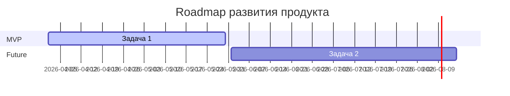

# PRD Template

## Artifact Metadata

| Поле | Значение |
|---|---|
| Статус | draft / partial / blocked / ready |
| Владелец | prd |

## Inputs Used

- `recursive-brief.md`
- `research-summary.md`
- `competitive-analysis.md`
- `proto-personas.md`

---

## Problem

### Executive Summary (Резюме продукта)
(Краткое описание проблемы, ценности продукта и того, как он решает боли целевой аудитории)

---

## Goals

### Цели и метрики

#### North Star (Метрика «Полярной звезды»)
(Главная метрика успеха продукта)

#### OKR 1: (Название цели)
*   **Objective**: (Описание цели)
    *   **KR 1.1**: (Ключевой результат 1)
    *   **KR 1.2**: (Ключевой результат 2)

#### OKR 2: (Название цели)
*   **Objective**: (Описание цели)
    *   **KR 2.1**: (Ключевой результат 1)
    *   **KR 2.2**: (Ключевой результат 2)

#### OKR 3: (Название цели)
*   **Objective**: (Описание цели)
    *   **KR 3.1**: (Ключевой результат 1)
    *   **KR 3.2**: (Ключевой результат 2)

---

## Non-Goals

- (Что мы осознанно не делаем в рамках этого продукта/MVP)

---

## Target Users & JTBD

| Сегмент пользователей | Роль / UX Опыт | Ключевые сценарии (JTBD) | Желаемый результат | Статус доказательства |
|---|---|---|---|---|
|  |  |  |  |  |

---

## Competitive Landscape (Конкурентный ландшафт)
(Сводный анализ ключевых конкурентов на основе competitive-analysis.md и наше позиционирование)

---

## MoSCoW

### MVP Scope (Границы проекта)

*   **[Фича 1 / Ключевой сценарий] [MUST]**: (Описание ключевой функциональности, критически важной для запуска)
*   **[Фича 2 / Основной интерфейс] [MUST]**: (Описание интерфейсных элементов, необходимых для работы)
*   **[Фича 3 / Интерактивный компонент] [MUST]**: (Описание логики взаимодействия и состояний)
*   **[Дополнительная фича] [SHOULD/COULD]**: (Описание желательных, но не критических для первой версии функций)
*   **Осознанно не в MVP [WON'T]**: (Что явно не входит в рамки MVP и переносится на будущее)

---

## User Stories (Пользовательские истории)

1.  **Пользовательская история 1:**
    *   *Как* [роль],
    *   *Я хочу* [действие],
    *   *Чтобы* [ценность].

---

## Requirements

### Функциональные требования

| ID | Requirement | User / business value | Evidence | Priority |
|---|---|---|---|---|
| REQ-001 |  |  |  | must |

### Нефункциональные требования (NFR)

*   **Производительность и UX**:
*   **Доступность (Accessibility)**:
*   **Адаптивность (Responsiveness)**:
*   **Безопасность и аналитика**:

---

## Acceptance Criteria

| Criterion | How to verify | Owner |
|---|---|---|
|  |  |  |

---

## Analytics

| Event | Trigger | Properties | PII risk | Success signal |
|---|---|---|---|---|
|  |  |  |  |  |

---

## Риски и открытые вопросы

### Открытые вопросы (Требуют кастдева)
1.  
2.  

### Ключевые риски
*   

---

## Roadmap (Дорожная карта развития)

*   **Этап 1 (MVP)**:
*   **Этап 2 (Future)**:

