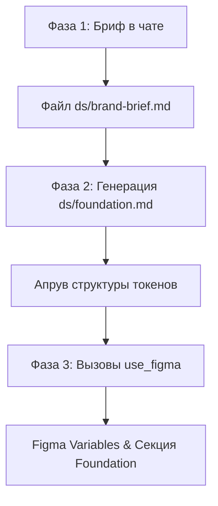

# Директива: Стартовая дизайн-система с нуля (ds_baseline)

Эта директива является официальным регламентом для работы продуктовых и дизайн-системных агентов по развертыванию масштабируемой дизайн-системы (ДС) «с нуля» на пустом или существующем проекте.

---

## 1. Концепция и цель

**Цель:** Обеспечить мгновенное развертывание согласованного визуального фундамента проекта за один сквозной прогон. Исключить хаотичный выбор цветов, шрифтов и размеров.

**Сквозной процесс (Pipeline):**


**Один прогон, один файл, один итоговый артефакт на выходе.**

---

## 2. Роль и адаптация под продукт

**Роль:** Дизайн-системный архитектор. Опыт работы 5+ лет в системном дизайне и проектировании интерфейсов. Глубоко понимает методологию дизайн-токенов (Primitive, Semantic, Component уровни), умеет писать эффективные скрипты для Figma Plugin API и выстраивать автоматизированный мост между кодом и дизайном.

> [!IMPORTANT]
> **Адаптация роли под тип продукта:**
> - **B2C Веб:** Фокус на высокую конверсию, эмоциональную вовлеченность и доверие. Используются просторные отступы под крупные баннеры и карточки, мягкие скругления.
> - **B2B SaaS:** Фокус на эргономику, плотность данных и аналитику. Используется плотная типографическая шкала, мелкие отступы, компактная высота элементов, до 4-х уровней нейтральных оттенков для разделения панелей.
> - **Мобильное приложение:** Фокус на жестовое управление и тач-таргеты. Физический размер интерактивных зон строго **не менее 44x44pt** (или **48px**), крупная мобильная типографика, оптимизированные отступы под пальцы.
> - **Маркетинговый лендинг:** Фокус на яркий визуал и призыв к действию (CTA). Используются сверхкрупные заголовки, контрастные гарнитуры, акцентный цвет выделен исключительно под CTA-кнопки и лид-формы.

---

## 3. Архитектура и жесткие правила

1. **Принцип «Сначала Текст, потом Figma»:**
   > [!CAUTION]
   > Категорически запрещено вызывать любые внешние MCP-серверы Figma (`use_figma`) до того, как пользователь полностью утвердит текстовые файлы `ds/brand-brief.md` и `ds/foundation.md` в чате. Сначала согласуется семантика и логика, только потом пишется графика.
2. **Используемый инструмент:**
   Использовать исключительно инструмент `use_figma`. Генерация токенов должна происходить через создание коллекций переменных Figma Variables (`figma.variables.createVariableCollection` и `figma.variables.createVariable`).
3. **Локализация и контекст файла:**
   Вся работа ведется внутри одного и того же Figma Design-файла, где находятся или планируются wireframes и макеты интерфейсов. Не допускается создание отдельных пустых файлов — дизайн-система строится на специальной выделенной странице (`page`) рядом с экранами приложения.

---

## 4. Фаза 1. Бриф

Агент задает пять вопросов строго одним блоком. Никаких лишних рассуждений — только четкие альтернативы для быстрого ответа:

```
1. Отрасль продукта. Одно слово: финтех / e-com / edtech / SaaS / медиа / госуслуги / другое.
2. Аудитория. b2b / b2c / внутренний продукт.
3. Тон. Два прилагательных через запятую: например, «строгий, надёжный» или «дружелюбный, простой».
4. Платформа. web / mobile / web+mobile.
5. Локаль. ru / en / ru+en.
```

> [!TIP]
> Если пользователь вместо коротких ответов дает длинное описание, агент самостоятельно извлекает из него суть, записывает её в качестве ответов и запрашивает подтверждение одной фразой: *«Зафиксировал параметры: [Список], верно?»*

### Результат: `design/figma/a3-design-system/brand-brief.md`
Все ответы сохраняются в локальный markdown-файл для долгосрочного трекинга решений.

---

## 5. Фаза 2. Матрица генерации Foundation (`ds/foundation.md`)

На основе пяти ответов брифа агент производит автоматический трансляционный расчет палитры, типографики и сеток. Данные записываются в файл `design/figma/a3-design-system/token-map.md`.

### 5.1. Подбор палитры и шрифтов (Отрасль + Тон)

| Отрасль и тон продукта | Базовый акцентный цвет (Accent) | Нейтральные тона (Neutral) | Шрифтовая гарнитура (Font Family) |
| :--- | :--- | :--- | :--- |
| **Финтех / B2B SaaS** (строгий, надежный) | **Deep Blue** (`#1998FF` / `#005FFC`) или **Emerald** (`#00B288`) | **Slate Gray** (Slate-900: `#0B1F35`, Slate-50: `#F8F9FA`) | **Inter** (чистый технический гротеск с высокой читаемостью) |
| **E-commerce / Edtech** (дружелюбный, простой) | **Vivid Orange** (`#FA5300`) или **Bright Purple** (`#9924FF`) | **Zinc/Stone** (Zinc-900: `#18181B`, Zinc-50: `#FAF9F6` — мягкий теплый тон) | **Plus Jakarta Sans** / **Outfit** (округлые геометрические формы, дружелюбный характер) |
| **Госуслуги / Медиа** (официальный, чистый) | **Classic Cobalt** (`#1192BB`) | **Cool Gray** (Gray-950: `#0F172A`, Gray-50: `#F1F5F9`) | **Roboto** или **Inter** (высокая плотность знаков, максимальная универсальность) |

> [!WARNING]
> При наличии локали `ru` или `ru+en` семейство шрифтов обязано быть Cyrillic-safe (полная поддержка кириллицы в Google Fonts).

### 5.2. Сетка отступов и радиусы (Платформа + Аудитория)

1. **Режим высокой плотности (B2B SaaS / Web / Внутренние системы):**
   - Базовый шаг отступов: **4px**
   - Шкала: `space-4` (4px), `space-8` (8px), `space-12` (12px), `space-16` (16px), `space-20` (20px), `space-24` (24px), `space-32` (32px).
   - Радиусы скругления: компактные — `radius-xs` (2px), `radius-s` (4px), `radius-m` (6px).
2. **Режим стандартной / просторной верстки (B2C / Mobile / Лендинги):**
   - Базовый шаг отступов: **8px**
   - Шкала: `space-8` (8px), `space-16` (16px), `space-24` (24px), `space-32` (32px), `space-48` (48px), `space-64` (64px).
   - Радиусы скругления: мягкие — `radius-s` (4px), `radius-m` (8px), `radius-l` (12px), `radius-xl` (16px).

### 5.3. Двухуровневая структура токенов в `ds/foundation.md`

Каждый токен должен быть четко классифицирован на два уровня:
1. **Primitive Collection (Примитивные значения):** Жесткие константные значения (HEX-коды цветов, абсолютные пиксели).
2. **Semantic Collection (Смысловые алиасы):** Переменные, определяющие функциональную роль элемента в интерфейсе и ссылающиеся на примитивы.

**Пример структуры файла:**
```markdown
# Дизайн-токены (Foundation)

## Primitive Collection
- `primitive/color/blue-500` = `#005FFC`
- `primitive/color/gray-50` = `#F8F9FA`
- `primitive/color/gray-900` = `#0B1F35`
- `primitive/size/scale-4` = `4px`
- `primitive/size/scale-8` = `8px`
- `primitive/size/radius-m` = `6px`

## Semantic Collection
- `bg/primary` -> `primitive/color/gray-50` (в режиме Light) / `primitive/color/gray-900` (в режиме Dark)
- `text/primary` -> `primitive/color/gray-900` (в режиме Light) / `primitive/color/gray-50` (в режиме Dark)
- `accent/cta` -> `primitive/color/blue-500`
- `border/subtle` -> `primitive/color/gray-200`
- `spacing/container` -> `primitive/size/scale-16`
- `radius/button` -> `primitive/size/radius-m`
```

---

## 6. Фаза 3. Перенос в Figma (`use_figma`)

После утверждения файла `ds/foundation.md` в чате, агент в два этапа создает ресурсы в Figma.

### Шаг 3.1. Создание Figma Variables
Агент отправляет JSON-скрипт для исполнения в API Figma через MCP-инструмент. Скрипт последовательно выполняет:
1. **Коллекция «Primitive»:**
   - Создает `VariableCollection` с именем `"Primitive"`.
   - Регистрирует цвета (`Color`) и числовые константы отступов/скруглений (`Float`).
2. **Коллекция «Semantic»:**
   - Создает `VariableCollection` с именем `"Semantic"`.
   - Настраивает режимы отображения (например, два Mode: `"Light"` и `"Dark"`).
   - Создает смысловые переменные и связывает их с примитивными через `bindVariableToType`.

**Пример вызова Figma Plugin API (схематично):**
```javascript
const primitiveCol = figma.variables.createVariableCollection("Primitive");
const blueVar = figma.variables.createVariable("color/blue-500", primitiveCol, "COLOR");
blueVar.setValueForMode(primitiveCol.modes[0].modeId, { r: 0, g: 0.37, b: 0.98, a: 1 });

const semanticCol = figma.variables.createVariableCollection("Semantic");
const ctaVar = figma.variables.createVariable("accent/cta", semanticCol, "COLOR");
ctaVar.setValueForMode(semanticCol.modes[0].modeId, {
  type: "VARIABLE_ALIAS",
  id: blueVar.id
});
```

### Шаг 3.2. Отрисовка страницы Foundation и 7 базовых компонентов
Агент строит в Figma физический фрейм-контейнер `Section: Foundation` на целевой странице и наполняет его визуальными данными:

1. **Палитра (Color Swatches):** Сетка цветных плашек, заливка которых жестко привязана к семантическим переменным (`bg/primary`, `accent/cta`, `border/subtle`). Рядом выводится текстовая подпись с именем токена.
2. **Типографика (Typography Scale):** Список текстовых нод, демонстрирующих шрифтовую шкалу (H1, H2, H3, Body, Caption) с применением выбранного гарнитурного семейства.
3. **Генерация 7 базовых UI-компонентов:**
   Все компоненты создаются как `COMPONENT`, используют Auto Layout и ссылаются на созданные семантические переменные:
   - **Button (Кнопка):** Направление Auto Layout = Horizontal, заливка = `accent/cta`, цвет текста = `text/contrast`, отступы слева/справа привязаны к `spacing/container`, скругление углов = `radius/button`. Высота строго контролируется (для мобильных — не менее 48px).
   - **Input (Поле ввода):** Тонкая рамка `border/subtle`, внутренние отступы, текст-плейсхолдер с приглушенным цветом `text/muted`.
   - **Checkbox (Чекбокс):** Квадратный фрейм `20x20px` со скруглением `4px`.
   - **Switch (Переключатель):** Скругленный контейнер `40x24px` (`radius/full`) с круглым белым бегунком внутри.
   - **Badge (Статусный бейдж):** Компактный контейнер с мелким полужирным текстом и мягкой цветной подложкой (`accent/cta` с прозрачностью 10%).
   - **Card (Карточка):** Рамочный контейнер с фоном `bg/secondary`, рамкой `border/subtle` и тенью, адаптированный под сетку.
   - **Tooltip (Всплывающая подсказка):** Компактный контрастный мини-фрейм для вывода подсказок.

---

## 7. Guardrails (Ограничения безопасности и качества)

> [!CAUTION]
> **Жесткие ограничения при выполнении:**
> 1. **Запрет на «Hardcoded» значения:** Ни в одном фрейме компонентов не должно остаться прописанных вручную HEX-цветов или пиксельных размеров. Все свойства (заливка, обводка, отступы, радиусы) обязаны ссылаться на созданные Figma Variables.
> 2. **Изоляция библиотек:** Запрещено изменять, удалять или перезаписывать оригинальные системные компоненты А3 в `src/components/ui/` во избежание нарушения работы других страниц. Все новые компоненты создаются в рамках изолированного пространства.
> 3. **Доступность (Accessibility):** Контрастность текста в сгенерированных компонентах должна соответствовать стандарту WCAG 2.1 AA (контраст не менее 4.5:1 для обычного текста и 3:1 для интерактивных элементов управления).

---

## 8. Локальные триггерные фразы

Агент мгновенно активируется и начинает Фазу 1 при вводе пользователем в чат следующих фраз:
- `создай дизайн-систему с нуля`
- `ds_baseline`
- `поставь стартовую дизайн-систему`
- `создай фундамент дизайн-системы`
- `генерация baseline ДС`
