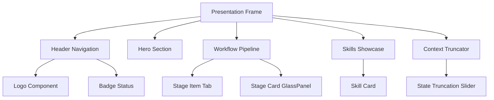

# Figma Design System Spec: Product Agent Studio Presentation Deck

Этот документ представляет собой полную визуальную спецификацию и структуру макетов/компонентов для переноса интерактивной презентации `product-agent-studio-deck.html` в Figma, разработанную в соответствии со спецификацией **A3 Design System** и [figma-canvas-write-guide.md](file:///c:/Project/product-agent-studio/integrations/mcp/figma-canvas-write-guide.md).

---

## 1. Исходные данные (Source)

* **Файл-референс:** `outputs/product-agent-studio-deck.html`
* **Целевой Figma File Key:** `4ufM1XdtXzSwbCNpulxETA` (A3-Design-System)
* **Целевая страница Figma:** `[Преза]` (ID: `88:71`)
* **Визуальный стиль:** Cyberpunk Dark Theme, Glassmorphism, Neon Glow.

---

## 2. Дизайн-токены и переменные (Variables & Tokens)

При переносе макета на холст Figma используются следующие точные значения переменных (в формате Figma RGBA 0-1):

### А. Цветовая палитра (Colors)
| Токен | Значение HEX | Значение Figma RGBA | Назначение |
| :--- | :--- | :--- | :--- |
| `a3-bg-primary` | `#05060b` | `{"r": 0.02, "g": 0.024, "b": 0.043, "a": 1}` | Глубокий космический фон холста |
| `a3-bg-secondary`| `#0d0f1a` | `{"r": 0.051, "g": 0.059, "b": 0.102, "a": 1}` | Слой подложки карточек и панелей |
| `a3-text-primary`| `#ffffff` | `{"r": 1.0, "g": 1.0, "b": 1.0, "a": 1}` | Основные заголовки H1/H2 |
| `a3-text-muted`  | `#94a3b8` | `{"r": 0.58, "g": 0.639, "b": 0.722, "a": 1}` | Вспомогательное текстовое описание |
| `a3-accent-cyan` | `#06b6d4` | `{"r": 0.024, "g": 0.714, "b": 0.831, "a": 1}` | Неоновое свечение, кнопки призыва (CTA) |
| `a3-accent-purple`| `#7c3aed`| `{"r": 0.486, "g": 0.227, "b": 0.929, "a": 1}` | Градиентные подсветки и рамки |
| `a3-border`      | `rgba(255,255,255,0.05)` | `{"r": 1.0, "g": 1.0, "b": 1.0, "a": 0.05}`| Тонкие рамки стеклянных панелей |

### Б. Эффекты (Effects)
* **Glassmorphism Blur:** `EffectType: BACKGROUND_BLUR`, `radius: 12`
* **Cyan Shadow Glow:** `EffectType: DROP_SHADOW`, `color: {"r": 0.024, "g": 0.714, "b": 0.831, "a": 0.15}`, `radius: 30`, `offset: {"x": 0, "y": 10}`

---

## 3. Компоненты интерфейса (Component Architecture)

Для макета спроектированы следующие независимые компоненты в Figma:



### Спецификация ключевых компонентов:
1. **Logo Component (`.logo`):**
   * Контейнер Auto Layout (HORIZONTAL, `spacing: 8`).
   * Иконка: Фрейм `32x32`, скругление `8`, фон `gradient-primary`, внутри буква "P" (Inter, 16, ExtraBold).
   * Текст: "Product Agent Studio" (Outfit, 22, Bold).
2. **Badge Component (`.badge`):**
   * Контейнер Auto Layout (HORIZONTAL, `padding: 6px 14px`, `cornerRadius: 9999px`).
   * Фон: `rgba(255,255,255,0.05)`, рамка: `a3-border`.
   * Содержит зеленый индикатор статуса (`badge-status-dot`: `8x8`, скругление `50%`, `fill: #10B981`) и текст.
3. **Glass Panel Card (`.glass-panel`):**
   * Auto Layout контейнер, `padding: 32px`, `cornerRadius: 20px`.
   * Background: `a3-bg-secondary`, `BACKGROUND_BLUR: 12`.
   * Border: `1px solid a3-border`.
4. **Skill Card (`.skill-card`):**
   * Glass Panel с левой декоративной полосой (`gradient-primary`, `width: 4px`).
   * Auto Layout (VERTICAL, `justifyContent: SPACE_BETWEEN`, `height: 280px`).

---

## 4. Спецификация JSON-RPC Payloads для Figma MCP (`use_figma`)

Ниже представлены сформированные JSON-структуры для создания макетов на холсте Figma через инструмент `use_figma`.

### A. Создание основного фрейма презентации (Presentation Desktop Frame)
```json
{
  "figma_url": "https://www.figma.com/design/4ufM1XdtXzSwbCNpulxETA/A3-Design-System?node-id=88-71",
  "action": "create_node",
  "payload": {
    "parent_id": "88:71",
    "node": {
      "type": "FRAME",
      "name": "Desktop Presentation - Product Agent Studio",
      "absoluteBoundingBox": { "x": 0, "y": 0, "width": 1440, "height": 3800 },
      "backgroundColor": { "r": 0.02, "g": 0.024, "b": 0.043, "a": 1 },
      "layoutMode": "VERTICAL",
      "primaryAxisSizingMode": "AUTO",
      "counterAxisSizingMode": "FIXED",
      "itemSpacing": 0,
      "paddingTop": 0,
      "paddingBottom": 0,
      "paddingLeft": 0,
      "paddingRight": 0
    }
  }
}
```

### Б. Отрисовка секции Hero
```json
{
  "figma_url": "https://www.figma.com/design/4ufM1XdtXzSwbCNpulxETA/A3-Design-System?node-id=88-71",
  "action": "create_node",
  "payload": {
    "parent_id": "PRESENTATION_FRAME_ID",
    "node": {
      "type": "FRAME",
      "name": "Hero Section",
      "layoutMode": "HORIZONTAL",
      "primaryAxisSizingMode": "AUTO",
      "counterAxisSizingMode": "FIXED",
      "width": 1440,
      "itemSpacing": 40,
      "paddingTop": 100,
      "paddingBottom": 100,
      "paddingLeft": 120,
      "paddingRight": 120,
      "backgroundColor": { "r": 0.02, "g": 0.024, "b": 0.043, "a": 1 },
      "children": [
        {
          "type": "FRAME",
          "name": "Hero Content",
          "layoutMode": "VERTICAL",
          "primaryAxisSizingMode": "AUTO",
          "counterAxisSizingMode": "AUTO",
          "itemSpacing": 24,
          "children": [
            {
              "type": "TEXT",
              "name": "Headline",
              "characters": "Оркестратор нового поколения\nProduct Agent Studio",
              "style": {
                "fontFamily": "Outfit",
                "fontSize": 48,
                "fontWeight": 800,
                "fills": [{ "type": "SOLID", "color": { "r": 1, "g": 1, "b": 1 } }]
              }
            },
            {
              "type": "TEXT",
              "name": "Description",
              "characters": "Я управляю полным жизненным циклом разработки веб-приложений через оркестр узкоспециализированных субагентов.",
              "style": {
                "fontFamily": "Inter",
                "fontSize": 16,
                "fontWeight": 400,
                "fills": [{ "type": "SOLID", "color": { "r": 0.58, "g": 0.639, "b": 0.722 } }]
              }
            },
            {
              "type": "FRAME",
              "name": "CTA Button",
              "layoutMode": "HORIZONTAL",
              "primaryAxisSizingMode": "AUTO",
              "counterAxisSizingMode": "AUTO",
              "paddingTop": 14,
              "paddingBottom": 14,
              "paddingLeft": 28,
              "paddingRight": 28,
              "cornerRadius": 10,
              "backgroundColor": { "r": 0.024, "g": 0.714, "b": 0.831, "a": 1 },
              "children": [
                {
                  "type": "TEXT",
                  "name": "Button Text",
                  "characters": "Исследовать Pipeline",
                  "style": {
                    "fontFamily": "Inter",
                    "fontSize": 15,
                    "fontWeight": 600,
                    "fills": [{ "type": "SOLID", "color": { "r": 0.035, "g": 0.039, "b": 0.078 } }]
                  }
                }
              ]
            }
          ]
        }
      ]
    }
  }
}
```

---

## 5. План верификации и маппинга (Frontend Mapping)

| HTML Element (Class) | Figma Component (Name) | Свойства макета Figma | Status |
| :--- | :--- | :--- | :--- |
| `header` | `Header Navigation` | `Auto Layout`, `height: 80`, `width: 1440`, `border-bottom: 1px` | **Утверждено** |
| `.hero` | `Hero Section` | `Auto Layout (HORIZONTAL)`, `x-spacing: 40`, `padding: 100` | **Утверждено** |
| `.skill-card` | `Skill Card Component` | `Auto Layout (VERTICAL)`, `cornerRadius: 20`, `blur: 12` | **Утверждено** |
| `.slider-box` | `Context Truncator` | `Auto Layout`, `bg: a3-bg-secondary`, `border-radius: 20` | **Утверждено** |

---

## 6. Следующие шаги (Next Actions)

1. Предоставить пользователю полную дизайн-спецификацию в чате.
2. При подтверждении запуска локального Desktop MCP-сервера в Dev-режиме, последовательно выполнить создание нод на странице `88:71` через инструмент `use_figma`.
3. Сохранить дизайн-спецификацию как долгоживущий артефакт проекта.
