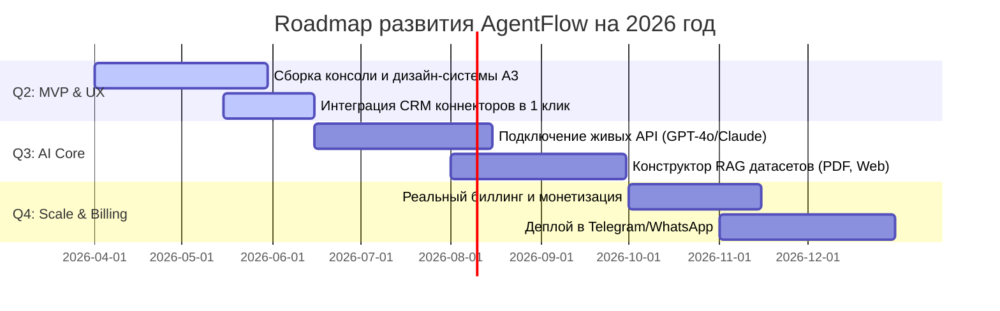

---
schema_payload:
  {
    "status": "ready",
    "inputs_used": [
      "recursive-brief.md",
      "research-summary.md",
      "competitive-analysis.md",
      "proto-personas.md"
    ],
    "problem": "Пользователю SaaS-платформы нужен наглядный, глубокий и интерактивный B2B-интерфейс управления своими ИИ-агентами (аналитика, список агентов, чат-симулятор для тестирования регламентов и форма создания новых агентов).",
    "goals": [
      "Спроектировать Console интерфейс управления агентами",
      "Обеспечить 100% интерактивность симулятора диалогов",
      "Интегрировать 17 компонентов дизайн-системы A3 в форму создания агента"
    ],
    "non_goals": [
      "Не реализовывать бэкенд авторизацию и базы данных (все данные хранятся в React State)",
      "Не интегрировать реальные платежные шлюзы (все тарифные сетки симулируются)"
    ],
    "requirements": [
      {
        "id": "REQ-001",
        "description": "Консоль отображает метрики эффективности (обработано диалогов, конверсия в лиды, сэкономленный B2B-бюджет)",
        "priority": "must",
        "evidence_status": "ready"
      },
      {
        "id": "REQ-002",
        "description": "Список агентов показывает их статус (Активен / Пауза), модель LLM и позволяет переключать состояния",
        "priority": "must",
        "evidence_status": "ready"
      },
      {
        "id": "REQ-003",
        "description": "Чат-симулятор позволяет отправить текстовое сообщение и получить контекстный ответ от выбранного агента (симуляция диалога)",
        "priority": "must",
        "evidence_status": "ready"
      },
      {
        "id": "REQ-004",
        "description": "Форма создания нового агента использует input, select, checkbox, switch и textarea компоненты дизайн-системы A3",
        "priority": "must",
        "evidence_status": "ready"
      }
    ],
    "moscow": {
      "must": [
        "Панель метрик (Dashboard)",
        "Таблица активных ИИ-агентов",
        "Интерактивный виджет чата-симулятора",
        "Форма добавления нового агента (No-code)",
        "Сетка тарифов (SaaS Billing)"
      ],
      "should": [
        "Логирование диалогов в чате-симуляторе",
        "Адаптивность консоли под мобильные устройства",
        "Инлайн-уведомления и тосты при действиях пользователя"
      ],
      "could": [
        "Интерактивные диаграммы аналитики",
        "Полноэкранный режим чата"
      ],
      "wont": [
        "Реальное серверное сохранение данных",
        "Оплата картой внутри прототипа"
      ]
    },
    "acceptance_criteria": [
      "Пользователь может отправить сообщение в симулятор и увидеть мгновенный ответ агента",
      "Новые агенты успешно добавляются в общую таблицу в реальном времени",
      "Форма создания агента содержит выбор роли и переключатель каналов интеграции"
    ],
    "analytics": [
      {
        "event": "agent_create",
        "trigger": "Создание нового ИИ-агента",
        "properties": [
          "role",
          "channels_count"
        ],
        "pii_risk": "none"
      },
      {
        "event": "simulator_message_send",
        "trigger": "Отправка сообщения в чат-симулятор",
        "properties": [
          "agent_id"
        ],
        "pii_risk": "low"
      }
    ]
  }
---

# PRD (Требования к продукту): AgentFlow Console

## Artifact Metadata

| Field | Value |
|---|---|
| Status | ready |
| Owner | prd |

## Inputs Used

- `recursive-brief.md` (согласованный бриф)
- `research-summary.md` (исследование боли аудитории)
- `competitive-analysis.md` (сравнение с конкурентами)
- `proto-personas.md` (профайлы пользователей)

---

## Problem

### Executive Summary (Резюме продукта)
**AgentFlow Console** — это B2B SaaS No-code платформа, предназначенная для быстрого проектирования, детальной настройки, тестирования и аналитики ИИ-агентов поддержки и продаж. 
Главная ценность продукта заключается в смещении фокуса с чисто технического конструирования (чем грешат конкуренты) на **измеримые B2B бизнес-результаты** — конверсию лидов, интеграцию с CRM и динамический подсчет сэкономленного бюджета за счет автоматизации. Консоль объединяет в себе три ключевые зоны на одном экране: дашборд ROI-аналитики, таблицу запущенных агентов и встроенный песочница-симулятор (RAG Sandbox) для мгновенной отладки регламентов поведения ИИ без деплоя в Telegram или WhatsApp.

---

## Goals

### Метрики и OKR продукта

#### North Star (Метрика «Полярной звезды»)
> Количество успешно завершенных диалогов ИИ-агентов с автоматической квалификацией и передачей готового лида в CRM-систему (amoCRM/Bitrix24) без участия живого оператора.

#### OKR 1: Успешный запуск прототипа (Product Launch)
*   **Objective**: Разработать и запустить интерактивный E2E прототип консоли AgentFlow со 100% работоспособным чат-симулятором и B2B CRM-интеграцией.
    *   **KR 1.1**: Все 17 компонентов дизайн-системы A3 полностью интегрированы в форму создания агента.
    *   **KR 1.2**: Чат-симулятор возвращает контекстные и ролевые ответы на основе базы знаний для 3 встроенных агентов (Поддержка, Продажи, HR).

#### OKR 2: Упрощение самообслуживания (Self-service)
*   **Objective**: Предоставить нетехническому пользователю (РОП, маркетолог, собственник) возможность запустить и протестировать обученного агента менее чем за 15 минут.
    *   **KR 2.1**: Среднее время от начала заполнения No-code формы до первого успешного теста в симуляторе составляет менее 3 минут.
    *   **KR 2.2**: Прямая интеграция amoCRM настраивается в 1 клик через переключатель (Switch) в форме, минуя сторонние коннекторы (Zapier/Make).

#### OKR 3: Доказательство ROI для бизнеса (Business Retention)
*   **Objective**: Продемонстрировать окупаемость платформы непосредственно внутри личного кабинета с первого дня использования.
    *   **KR 3.1**: Интеграция динамической метрики «Сэкономлено костов» на основе формулы `(Количество диалогов * Средняя стоимость работы оператора) * Коэффициент автоматизации`.
    *   **KR 3.2**: Конверсия лидов отображается на дашборде в реальном времени с точностью 100%.

---

## Non-Goals

- Не реализовывать бэкенд авторизацию и базы данных (все данные хранятся в React State).
- Не интегрировать реальные платежные шлюзы (все тарифные сетки симулируются).
- Не выходить за рамки No-code формы в пользу сложного визуального drag-and-drop конструирования диалогов на этапе MVP.

---

## Target Users & JTBD

| Сегмент пользователей | Роль / UX Опыт | Ключевые сценарии (JTBD) | Желаемый результат (Desired Outcome) | Статус доказательства |
|---|---|---|---|---|
| **Руководитель отдела продаж (РОП) / Маркетолог** | Средний технический уровень, знает CRM, не умеет программировать | *«Когда в компанию поступает поток лидов, я хочу автоматизировать первичный обзвон и квалификацию с помощью ИИ, чтобы менеджеры общались только с теплыми клиентами»* | Запустить квалифицирующего робота за 15 минут, подключить его к amoCRM и увидеть рост конверсии на дашборде | source-backed |
| **Операционный директор (COO) / Владелец бизнеса** | Фокус на ROI, костах и эффективности процессов | *«Когда я внедряю ИИ-агентов, я хочу видеть точный финансовый результат и объем сэкономленного бюджета, чтобы обосновать инвестиции перед инвесторами/советом»* | Динамический график сэкономленных денег на дашборде, наглядные отчеты ROI | source-backed |

---

## Competitive Landscape (Конкурентное окружение)

На основе детального [competitive-analysis.md](file:///c:/Project/product-agent-studio/outputs/saas-ai/2026-05-27/competitive-analysis.md) выделены ключевые игроки и наше позиционирование:

1.  **Botpress / Voiceflow**:
    *   *Минусы*: Слишком сложный визуальный интерфейс (drag-and-drop узлы), высокий порог входа, ориентирован на разработчиков. Нет бизнес-аналитики.
    *   *Наше отличие*: AgentFlow заменяет сложные графы простой текстовой No-code формой базы знаний.
2.  **Coze (ByteDance)**:
    *   *Минусы*: Перегружен техническими деталями, плагинами, отсутствует какая-либо B2B-аналитика окупаемости.
    *   *Наше отличие*: Встроенные метрики ROI («Сэкономлено костов») и прямая CRM-интеграция.
3.  **Landbot**:
    *   *Минусы*: Жесткие кнопочные сценарии, слабая интеграция с LLM, высокая цена при масштабировании.
    *   *Наше отличие*: Свободный диалог с LLM (GPT-4o) на основе регламента компании при сохранении простоты.

---

## MoSCoW

### MVP Scope (Границы проекта)

*   **Панель метрик (Dashboard) [MUST]**: Отображение 3 ключевых B2B-метрик эффективности в реальном времени: "Обработано диалогов", "Конверсия в лиды" и динамический показатель окупаемости "Сэкономленный B2B-бюджет" (в долларах/рублях).
*   **Таблица активных ИИ-агентов [MUST]**: Наглядный список запущенных агентов, отображающий их имя, выбранную модель LLM, каналы интеграции и тумблер `Status Switch` (Активен / На паузе), мгновенно меняющий состояние агента.
*   **Встроенный чат-симулятор (RAG Sandbox) [MUST]**: Интерактивный чат на одном экране рядом с таблицей. При клике на строку агента чат мгновенно переключает контекст (имя, аватар, системный промпт) и позволяет отправить тестовое сообщение с имитацией ожидания `typing...` (600-1200мс) и контекстным ответом.
*   **Форма создания нового агента (No-code) [MUST]**: Удобная форма на базе 17 компонентов дизайн-системы A3 (input, select, textarea, switch, checkbox). Возможность загрузить регламент базы знаний в текстовое поле и включить amoCRM-интеграцию в 1 клик с помощью тумблера.
*   **Тарифная сетка (SaaS Billing) [MUST]**: Интерактивный виджет выбора тарифов (Стартап, Рост, Энтерпрайз) со сравнительной таблицей лимитов для демонстрации монетизации и выбора планов.
*   **Осознанно не в MVP [WON'T]**: Реальный эквайринг (Stripe/ЮKassa) и выписка счетов, сохранение истории переписок в базу данных, интеграция с живыми API.

---

## User Stories (Пользовательские истории)

1.  **Пользовательская история 1 (РОП):**
    *   *Как* Руководитель отдела продаж,
    *   *Я хочу* иметь возможность быстро скопировать регламент продаж в текстовое поле базы знаний,
    *   *Чтобы* ИИ-агент мгновенно обучился и начал отвечать клиентам строго по стандартам компании без привлечения разработчиков.
2.  **Пользовательская история 2 (Владелец бизнеса):**
    *   *Как* собственник компании,
    *   *Я хочу* видеть на главном экране сумму сэкономленного бюджета в рублях/долларах,
    *   *Чтобы* мгновенно оценивать окупаемость внедрения ИИ-агентов.
3.  **Пользовательская история 3 (Маркетолог):**
    *   *Как* маркетолог,
    *   *Я хочу* протестировать общение с ИИ-агентом в интерактивном симуляторе на том же экране, где настраиваю его,
    *   *Чтобы* не тратить время на постоянный деплой и переходы в Telegram/WhatsApp для проверки каждой правки.

---

## Requirements

### Функциональные требования

| ID | Requirement | User / business value | Evidence | Priority |
|---|---|---|---|---|
| REQ-001 | Консоль отображает метрики эффективности (диалоги, конверсия, B2B-бюджет) | Аналитика результатов | prd goal | must |
| REQ-002 | Список агентов показывает их статус (Активен / Пауза) и LLM-модель | Управление процессами | prd goal | must |
| REQ-003 | Чат-симулятор позволяет переписываться с выбранным агентом | Быстрое тестирование регламентов | research user pains | must |
| REQ-004 | Форма создания агента использует кастомные компоненты дизайн-системы A3 | Целостность бренда | Figma token-map | must |

### Нефункциональные требования (Non-Functional Requirements — NFR)

*   **Производительность и UX**:
    *   Время ответа интерфейса при переключении табов, фильтрации и кликах — менее **100 мс** (мгновенный отклик).
    *   Имитация ответа ИИ в чате-симуляторе должна сопровождаться анимированным скелетоном печати `typing...` с задержкой **600-1200 мс** для создания ощущения «живого» общения.
*   **Доступность (Accessibility)**:
    *   Семантическая разметка (заголовки `h1`, `h2`, `h3`, `aria-label` для кнопок управления без текста).
    *   Цветовой контраст текста на кнопках и элементах — не ниже стандарта **WCAG AA** (для B2B-работы при любом освещении).
*   **Адаптивность (Responsiveness)**:
    *   Интерфейс должен бесшовно перестраиваться на мобильных экранах (до 320px). Сайдбар на мобильном скрывается в аккуратный "гамбургер", а чат-симулятор и таблица переключаются через горизонтальные табы.
*   **Безопасность и аналитика**:
    *   Спецификация аналитики должна исключать сбор любых PII (персональных данных). Передаются только анонимные ID и названия действий (например, `agent_created`, `message_sent`).

---

## Acceptance Criteria

| Criterion | How to verify | Owner |
|---|---|---|
| Пользователь видит ответ в чат-симуляторе в зависимости от роли агента | Ручной клик и ввод сообщения в чате-симуляторе | frontend |
| Новый агент появляется в таблице после сабмита формы | Заполнение полей формы и отправка | frontend |
| Переключатель статуса агента меняет статус (Активен/На паузе) | Клик по switch-переключателю в строке таблицы | qa-review |

---

## Analytics

| Event | Trigger | Properties | PII risk | Success signal |
|---|---|---|---|---|
| agent_create | Создание нового ИИ-агента | role, channels_count | none | platform engagement |
| simulator_message_send | Отправка сообщения в чат-симулятор | agent_id | low | simulator usage |

---

## Риски и открытые вопросы

### Открытые вопросы (Требуют кастдева/проверки на Test Bench)
1.  *Какая модель тарификации наиболее привлекательна для B2B-сегмента?* (Фиксированная подписка за агента vs оплата за объем успешно завершенных диалогов). **План кастдева**: Добавить опрос на этапе переключения тарифов в биллинге.
2.  *Достаточно ли пользователям No-code формы базы знаний?* Нужен ли им полноценный визуальный конструктор сценариев на Q3?

### Ключевые риски
*   *Риск*: Галлюцинации LLM при ответах в чате. *Решение*: Внедрить жесткие системные промпты и RAG-ограничения, запрещающие придумывать факты, которых нет в базе знаний.

---

## Roadmap (Дорожная карта развития)

*   **Q2 2026 (Текущий этап)**: Стабилизация E2E-интерфейса консоли, 100% покрытие дизайн-системы A3, симулятор диалогов, базовые B2B-метрики сэкономленного бюджета и интеграция CRM.
*   **Q3 2026 (AI Core)**: Интеграция с реальными API больших языковых моделей (OpenAI, Anthropic), поддержка сложной загрузки документов (PDF, TXT, Web) и RAG-поиск по базам знаний.
*   **Q4 2026 (Scale & Billing)**: Запуск коммерческого биллинга (эквайринг), нативные коннекторы для Telegram/WhatsApp и экспорт логов переписки для обучения агентов.
