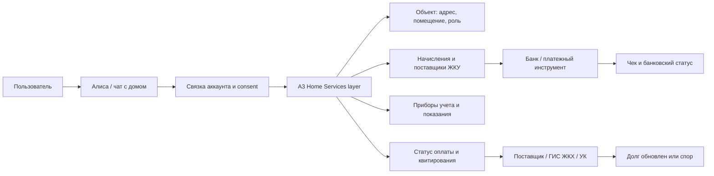

# Исследование: Исследовать интеграцию A3-платежей ЖКУ и домовых сценариев в Яндекс Алису / умный дом.

## Карта связей исследования
<!-- notion-section: overview -->

| Если читатель хочет понять... | Куда перейти |
|---|---|
| Какой главный вывод исследования и какие решения из него следуют | Раздел "Сводка исследования"; раздел "Конкурентный анализ" |
| Какие пользовательские сценарии и боли важнее всего | Раздел "CJM и сценарии"; раздел "ICE/RICE бэклог и инициативы" |
| Для кого это важно и какие допущения нужно проверить | Раздел "Прото-персоны"; раздел "Синтетические интервью и вопросы для интервью" |
| Почему приоритеты идут именно в таком порядке | Раздел "ICE/RICE бэклог и инициативы"; раздел "Roadmap и SWOT" |
| Какие риски, неизвестные и источники ограничивают выводы | Раздел "Roadmap и SWOT"; раздел "План валидации и источники" |

## Цепочка решений
<!-- notion-section: overview -->

| Доказательство | Интерпретация | Продуктовое решение | Где раскрыто подробнее |
|---|---|---|---|
| Source-backed факты показывают реальные ограничения рынка и поведения пользователей. | Выводы должны опираться на наблюдаемое событие, участника, документ или канал. | Продуктовые решения формулируются через конкретный сценарий и проверку. | "Сводка исследования", "Источники и журнал доказательств" |
| CJM показывает, где пользователь или операционная роль теряет понимание следующего шага. | Приоритет получает не самая громкая идея, а трение с понятным механизмом влияния. | Бэклог связывается с этапом CJM, метрикой и способом валидации. | "CJM и сценарии", "ICE/RICE бэклог и инициативы" |
| Прото-персоны и интервью-гайд отделяют факты от гипотез. | Сегменты нельзя считать подтвержденными без интервью, логов или первичных данных. | Следующий этап должен проверять самые рискованные допущения. | "Прото-персоны", "Синтетические интервью" |
| SWOT и источники фиксируют ограничения открытых данных. | Research не должен превращаться в уверенную стратегию без проверки спорных мест. | Риски и unknowns остаются в validation plan до подтверждения. | "Roadmap и SWOT", "План валидации и источники" |

## Сводка исследования
<!-- notion-section: overview -->

#### Ключевые выводы

Идея не выглядит как копирование уже массового рынка. Публично подтвержденного сценария "скажи умной колонке оплатить ЖКУ, и она оплатит через домовой контекст" не найдено. Зато есть сильная opportunity: A3 может стать платежно-статусным слоем между домовым объектом, начислением ЖКУ, поставщиком, банком и conversational-интерфейсом Алисы.

Практически это не должно начинаться с опасного "Алиса, оплати все сама". Первый продуктовый вариант: Алиса находит счет, объясняет сумму/период/получателя, уточняет адрес, открывает защищенное подтверждение в приложении Алисы или банка, а после оплаты показывает цепочку статусов: `банк принял -> платеж отправлен -> поставщик/ГИС ЖКХ учел -> долг обновлен`.

Главная ценность A3 в этой связке — не кнопка оплаты, а нормализация и доказуемость: какой объект, какой лицевой счет, какой поставщик, какой период, какая сумма, где чек, почему долг может висеть после оплаты, кто следующий ответственный участник.

#### Opportunity Statement

`Дом с Алисой` сегодня воспринимается как управление устройствами и сценариями жилья. A3 может расширить эту рамку до "дом как финансово-сервисный объект": счета, показания, статусы, заявки, семейные роли, напоминания и post-payment support. Тогда Алиса становится не кассиром, а понятным оператором домашнего контура.

#### Что подтверждено, а что является гипотезой

| Утверждение | Статус | Как использовать |
|---|---|---|
| Яндекс развивает Алису в сторону smart building services: домофон, пропуска, шлагбаум, камеры, связка аккаунта ЖК с Яндекс ID | source-backed_by_subagent | Доказательство канала и близости к жилому комплексу |
| Яндекс Smart Home работает через account linking, platform API, состояние устройств и команды | source-backed_by_subagent | Техническая рамка для интеграции, но не платежный proof |
| Госуслуги.Дом / ГИС ЖКХ контур закрывает ЖКУ, показания, обращения и статусы в домене жилья | reused_from_prior_A3_run | Доменный proof спроса и процессов |
| Голосовые ассистенты требуют explicit linking/consent/PIN patterns для персональных и чувствительных действий | adjacent_evidence | Trust и security reference |
| Алиса уже умеет или публично заявляет оплату ЖКУ через smart building | not_found | Нельзя утверждать в pitch без проверки/партнерского подтверждения |
| A3 может собрать "чат с домом" поверх начислений, статусов и ролей | product_inference | Перспективная гипотеза для discovery |

#### Product Thesis

Пользователь не хочет "платежку внутри умного дома" как отдельную функцию. Он хочет спросить дом простыми словами:

- "Что у меня с квартплатой?"
- "Почему долг висит?"
- "Оплати счет за квартиру, если все нормально."
- "Передай показания воды."
- "Напомни родителям оплатить."
- "Покажи чек и отправь маме."

Эти фразы должны превращаться в безопасные операции с явным объектом, источником данных и защищенным подтверждением.

#### P0 Ставка

Первый релиз должен быть не автоплатежным, а confirmation-first:

1. Алиса понимает интент: оплата, долг, показания, напоминание.
2. A3 находит объект, лицевой счет, начисление, поставщика и статус.
3. Алиса проговаривает только безопасный минимум и просит открыть подтверждение.
4. В приложении показывается полный платежный контекст.
5. Деньги подтверждаются через банк/биометрию/PIN, не только голосом.
6. После оплаты пользователь видит статус банка отдельно от статуса поставщика/ГИС ЖКХ.

#### MVP Scenarios

| Приоритет | Сценарий | Пользовательская задача | Почему именно он |
|---|---|---|---|
| P0 | Проверить счет ЖКУ | "Что пришло за квартиру?" | Самый безопасный вход: чтение и объяснение до оплаты |
| P0 | Подготовить оплату | "Оплати счет, если это мой адрес и правильный получатель" | Денежная ценность, но с обязательным app confirmation |
| P0 | Объяснить долг после оплаты | "Я заплатил, почему долг висит?" | Главная боль прошлого A3 исследования |
| P0 | Передать показания | "Скажи Алисе показания, но не ошибись в ХВС/ГВС" | Регулярный сценарий, сильная conversational fit |
| P0 | Напомнить | "Напомни оплатить/передать показания" | Безопасный low-risk entry point |
| P1 | Оплата за родителей | "Плачу за маму, не хочу заходить в ее аккаунт" | Сильный семейный use case, но нужна ролевая модель |
| P1 | Чат с домом | "Спросить одним диалогом про счет, долг, заявку, аварийку" | Делает Алису домовым оператором |
| P2 | Поверка, отключения, заявки, ремонт | "Что еще нужно дому?" | Расширение после платежного trust foundation |

#### Ключевые кейсы

Ниже ключевые кейсы исследования: это не тезисная выжимка, а подробные кейсы с привязкой к жизненной ситуации, моменту сомнения и проверке.

| Кейс | Кто -> ситуация -> трение -> решение -> почему сработает -> как проверяем |
|---|---|
| K1. Собственник хочет оплатить текущий счет | Собственник живет в квартире и слышит от Алисы напоминание о новом счете. Трение: он боится оплатить не того получателя или не понять, почему сумма отличается от прошлой. Решение: Алиса находит счет, но открывает приложение с адресом, периодом, получателем, source timestamp и банковским подтверждением. Это сработает, если пользователь видит не только сумму, но и источник начисления до списания. Проверяем в usability task: 6/8 пользователей без подсказки называют адрес, период и получателя перед нажатием оплаты. |
| K2. Долг висит после оплаты | Пользователь вчера оплатил ЖКУ, сегодня видит долг и думает, что банк или A3 ошиблись. Трение: банковский статус и статус поставщика смешаны в один зеленый/красный индикатор. Решение: показать timeline `банк принял -> платеж отправлен -> поставщик учел -> долг обновлен` и дать чек/обращение. Это сработает, если пользователь понимает, кто сейчас отвечает за задержку. Проверяем сценарием: 6/8 пользователей правильно выбирают следующий шаг "подождать обновления" или "отправить чек поставщику". |
| K3. Взрослый ребенок платит за родителей | Пользователь платит за маму, но у него есть еще своя квартира. Трение: голосовая команда "оплати квартиру" может выбрать не тот объект, а полный доступ к аккаунту родителя избыточен. Решение: роль `family_payer`, явная метка объекта "Родители", крупное подтверждение адреса в приложении и отправка чека после оплаты. Это сработает, если плательщик не путает адрес и не видит лишние данные собственника. Проверяем task test с двумя объектами: не более одной критической ошибки выбора адреса. |
| K4. Пользователь передает показания голосом | Пользователь стоит у счетчиков и диктует значения Алисе. Трение: можно перепутать ХВС/ГВС или назвать значение меньше прошлого. Решение: A3 показывает прошлые значения, проверяет период и просит read-back "ХВС 130, ГВС 87. Отправить?". Это сработает, если голос ускоряет ввод, но финальное подтверждение ловит ошибку. Проверяем Wizard-of-Oz тестом: 80% корректно подтверждают значения перед отправкой. |

#### Сквозной user flow

Сквозной user flow под CJM для P0:

1. Пользователь спрашивает Алису: "Что у меня с квартплатой?"
2. Алиса через account linking понимает профиль и передает запрос в A3.
3. A3 сопоставляет объект: адрес, помещение, роль, лицевой счет.
4. A3 возвращает текущий счет: сумма, период, получатель, источник и дата обновления.
5. Алиса кратко отвечает и предлагает открыть подтверждение в приложении.
6. В приложении пользователь проверяет адрес, сумму, получателя, комиссию и источник.
7. Пользователь подтверждает оплату через банк/биометрию/PIN.
8. После оплаты A3 показывает два слоя статуса: банковская операция и учет у поставщика/ГИС ЖКХ.
9. Если долг висит, пользователь открывает чек, видит дату последнего обновления у поставщика и может отправить обращение.

#### Вопрос пользователя

| Этап | User question | Product answer |
|---|---|---|
| Найден счет | "Это точно моя квартира и правильный получатель?" | Адрес, роль, период, получатель, source timestamp |
| Перед оплатой | "Что произойдет, если я подтвержу?" | Деньги спишутся только после банковского подтверждения; голос не является списанием |
| После оплаты | "Почему долг еще виден?" | Банк и поставщик имеют разные статусы; показать timeline и дату обновления |
| Показания | "Я не перепутал холодную и горячую воду?" | Показать прошлые значения и read-back новых |
| Семейный объект | "Я плачу за родителей или за себя?" | Метка объекта, роль `family_payer`, крупный адрес перед оплатой |

#### Метрики проверки

| Metric | Target | Why |
|---|---|---|
| `payment_context_comprehension` | 6/8 пользователей правильно называют адрес, период, получателя до оплаты | Проверяет, что голосовой старт не скрывает платежный контекст |
| `status_model_comprehension` | 6/8 пользователей различают банк, поставщика и долг после оплаты | Проверяет главный риск "оплатил, но долг висит" |
| `wrong_object_error_rate` | <= 1 critical error in 8 tests with two objects | Проверяет семейный и multi-object сценарий |
| `meter_readback_success` | 80% корректно подтверждают ХВС/ГВС перед отправкой | Проверяет безопасность голосового ввода показаний |
| `voice_to_app_handoff_acceptance` | majority preference for app confirmation over voice-only payment | Проверяет trust boundary MVP |

#### Product Architecture Hypothesis

#### Trust Model

| Риск | Что нельзя делать | Что делать вместо |
|---|---|---|
| Shared-device privacy | Проговаривать адрес, долг и сумму на колонке без контекста профиля | Дать краткий ответ и открыть детали в приложении |
| Ошибка распознавания | Платить по одной фразе при нескольких объектах | Read-back адреса, периода, получателя и суммы |
| Небезопасная оплата | Включать автосписание голосом | Голос готовит действие, деньги подтверждаются защищенно |
| Долг висит после оплаты | Говорить "оплачено" как финальный статус поставщика | Показывать разные статусы банка и поставщика |
| Семейный доступ | Давать плательщику полный аккаунт собственника | Роль "плательщик" с ограниченными данными |

#### Как показать пользователю в приложении Алисы

Экран подтверждения должен выглядеть не как обычная квитанция, а как trust checkpoint:

- адрес и роль: "Вы платите за квартиру родителей";
- период и сумма;
- получатель и источник начисления;
- дата обновления данных;
- что произойдет после оплаты;
- способ оплаты и комиссия, если есть;
- CTA "Оплатить" только после банковского подтверждения;
- блок "После оплаты": чек, статус банка, статус поставщика, дата следующей проверки;
- recovery: "Долг еще висит?" с чеком и маршрутом обращения.

#### Visual Evidence Plan

Lazyweb preflight по точным flow-запросам `chat payment confirmation bill pay` и `checkout confirmation` вернул нулевое покрытие. Поэтому текущий research pack не закрывает визуальный benchmark для макетов.

Перед Figma или frontend нужно отдельно собрать visual references:

1. реальные экраны Яндекс `Дом с Алисой` и Smart Building, если доступны;
2. экраны банковского подтверждения платежа ЖКУ;
3. экраны Госуслуги.Дом: счет, показания, обращение, статус;
4. voice assistant consent / account linking patterns;
5. chat/payment confirmation patterns из других источников, если Lazyweb не покрывает.

#### Стратегическая рекомендация

Позиционировать концепт как `A3 Home Assistant Payments`, а не как "голосовая оплата ЖКУ".

Формула для pitch:

> A3 позволяет Алисе не просто управлять лампочками, а понимать дом как финансово-сервисный объект: найти счет, объяснить долг, подготовить оплату, принять показания и показать, кто отвечает за следующий статус.

#### Open Questions

1. Может ли A3 получать не только начисление, но и статус квитирования у поставщика/ГИС ЖКХ?
2. Где будет финальное подтверждение: приложение Алисы, банк-партнер, webview A3, deep link в банк?
3. Какие данные можно безопасно проговаривать на колонке, а какие только показывать в приложении?
4. Как Яндекс трактует денежные операции внутри smart-home skills и skills moderation?
5. Можно ли начать с reminder/status-only MVP без платежа, чтобы проверить trust?

## Пользовательские флоу исследования
<!-- notion-section: scenario_flows -->

#### Таблица персон

| Персона | Контекст | Нужный outcome |
|---|---|---|
| Собственник-плательщик | Живет в квартире, платит ЖКУ каждый месяц | Понять счет, оплатить безопасно, убедиться что долг закрылся |
| Семейный плательщик | Платит за родителей или второй объект | Не перепутать адрес и получить чек без лишнего доступа |
| Пожилой собственник | Пользуется голосом охотнее, чем сложными приложениями | Понять сумму и срок, но не потерять контроль над деньгами |
| Арендатор | Передает показания или оплачивает часть услуг | Иметь ограниченную роль без полного доступа к собственнику |
| Пользователь умного дома | Уже говорит Алисе про свет, климат и домофон | Спросить "что с домом?" и получить счет/статус/заявку |

#### Flow 1: "Алиса, что у меня с квартплатой?"

##### Trigger

Пользователь спрашивает общую ситуацию по дому.

##### Steps

| Шаг | Channel | System behavior | User-facing response |
|---|---|---|---|
| 1 | Voice/chat | Алиса определяет интент `home.bill.status` | "Проверю счет по вашему дому." |
| 2 | A3 | A3 сопоставляет пользователя, объект, роль, лицевой счет | no visible output |
| 3 | Voice | Если один объект: краткий read-back адреса без лишних деталей | "По квартире на Ленина найден счет за июнь. Сумма 6 180 рублей." |
| 4 | App | Открывается карточка счета | Адрес, период, получатель, источник, дата обновления |
| 5 | App | Пользователь выбирает оплату, детализацию или напоминание | CTA: "Открыть оплату", "Почему такая сумма", "Напомнить" |

##### Acceptance

Пользователь должен понять, какой счет найден, за какой адрес и от какого источника данные.

#### Ключевые кейсы

Это подробные кейсы для CJM: кто действует, в какой жизненной ситуации, где возникает трение, какое решение предлагает A3 + Алиса, почему оно должно сработать и как проверяем результат.

| Кейс | Кто -> ситуация -> трение -> решение -> почему сработает -> как проверяем |
|---|---|
| KC1. Один объект, новый счет | Собственник получает новый счет за июнь. Трение: он не помнит, кому платил в прошлом месяце и почему сумма выросла. Решение: Алиса показывает счет через A3 и отправляет в приложение на карточку с получателем, периодом и source timestamp. Это сработает, потому что пользователь проверяет контекст до списания. Проверяем метрикой `payment_context_comprehension`. |
| KC2. Несколько объектов | Пользователь говорит "оплати квартиру", но у него своя квартира и квартира родителей. Трение: голосовая команда неоднозначна. Решение: Алиса спрашивает "ваша квартира или родители?" и приложение требует подтверждения адреса. Это сработает, если выбор объекта становится отдельным шагом, а не скрытой догадкой. Проверяем метрикой `wrong_object_error_rate`. |
| KC3. Долг после оплаты | Пользователь видит долг после банковского платежа. Трение: он не знает, кто виноват и что делать. Решение: статусная цепочка показывает банк, отправку поставщику и квитирование отдельно. Это сработает, если пользователь видит дату последнего обновления у поставщика. Проверяем метрикой `status_model_comprehension`. |
| KC4. Показания у счетчика | Пользователь диктует показания, стоя в ванной. Трение: голос может перепутать ресурс или цифру. Решение: Алиса повторяет прошлые и новые значения перед отправкой. Это сработает, если read-back ловит ошибки до API submit. Проверяем метрикой `meter_readback_success`. |

#### Сквозной user flow

Сквозной user flow под CJM:

1. Entry: пользователь говорит Алисе бытовую фразу, не выбирая поставщика вручную.
2. Intent: Алиса классифицирует `bill_status`, `payment_prepare`, `debt_explain`, `meter_submit` или `reminder_create`.
3. Identity: связка аккаунта подтверждает профиль пользователя.
4. Object: A3 выбирает или уточняет объект жилья.
5. Context: A3 возвращает счет, показания, долг или reminder context.
6. Guardrail: Алиса проговаривает только безопасный минимум; полные детали уходят в приложение.
7. Confirmation: деньги или отправка показаний подтверждаются отдельным явным действием.
8. Proof: пользователь получает чек, статус приема или reminder record.
9. Recovery: если внешний статус не сошелся, приложение показывает ответственного участника и следующий шаг.

#### Вопрос пользователя

| Moment | User question | Needed answer |
|---|---|---|
| До действия | "Алиса правильно поняла, какой дом?" | Адрес/метка объекта и роль |
| Перед списанием | "Это настоящий счет и правильный получатель?" | Источник начисления, получатель, период, дата данных |
| При подтверждении | "Голос уже списывает деньги?" | Нет, списание только после защищенного подтверждения |
| После платежа | "Почему долг не исчез?" | Разные статусы банка и поставщика |
| При ошибке | "Куда идти с чеком?" | Чек, контакт/канал обращения, дата последнего обновления |

#### Метрики проверки

| Metric | Target |
|---|---|
| `payment_context_comprehension` | 6/8 пользователей до оплаты называют адрес, период, получателя |
| `voice_payment_safety_understanding` | 6/8 понимают, что голос не является final authorization |
| `wrong_object_error_rate` | <= 1 critical wrong-object mistake per 8 tests |
| `status_model_comprehension` | 6/8 различают банк и поставщика |
| `meter_readback_success` | 80% подтверждают корректные ХВС/ГВС значения |

#### Flow 2: "Оплати счет за квартиру"

##### Principle

Голос запускает подготовку, но не списывает деньги сам.

| Шаг | Channel | System behavior | Ограничение |
|---|---|---|---|
| 1 | Voice | Алиса распознает `home.bill.pay.prepare` | Не использовать команду как финальное согласие |
| 2 | Voice | Алиса уточняет объект, если объектов больше одного | Адрес выбирается явно |
| 3 | A3 | A3 получает начисление, получателя, период, сумму | Данные показываются с датой обновления |
| 4 | Voice | Алиса кратко зачитывает сумму и получателя | Не проговаривать полный лицевой счет на колонке |
| 5 | App | Открывается `payment confirmation` | Адрес, период, сумма, получатель, источник, комиссия |
| 6 | Bank/App | Пользователь подтверждает через банк/биометрию/PIN | Это единственный момент списания |
| 7 | App/chat | Показывается статусная цепочка | Банк отдельно от поставщика |

##### Copy Example

> Нашла счет за июнь: 6 180 ₽, получатель УК "Север". Открыть подтверждение в приложении?

После оплаты:

> Банк принял платеж. У поставщика долг может обновиться позже. Проверить статус завтра?

#### Flow 3: "Почему долг висит?"

| Шаг | System question | Needed data | Output |
|---|---|---|---|
| 1 | Был ли платеж? | Bank payment status, receipt | "Платеж принят банком вчера в 19:42." |
| 2 | Доставлен ли платеж поставщику? | A3/payment routing status | "Платеж отправлен поставщику." |
| 3 | Учтен ли долг? | Supplier/GIS status, last update | "У поставщика данные обновлялись сегодня в 08:10, долг пока не закрыт." |
| 4 | Что делать? | Receipt, contact, claim channel | "Открыть чек и обращение поставщику." |

##### UX Rule

Не говорить просто "оплата прошла", если это только банковская операция. Пользователь должен видеть, какой слой уже завершен.

#### Flow 4: "Передай показания воды"

| Шаг | Channel | Behavior |
|---|---|---|
| 1 | Voice | Алиса определяет ресурс: ХВС/ГВС или просит уточнить |
| 2 | A3 | Получает последние принятые значения и открытый период |
| 3 | Voice | Алиса просит новые значения |
| 4 | A3 | Валидирует: значение не меньше прошлого, период открыт, прибор активен |
| 5 | Voice/App | Алиса зачитывает read-back: "Холодная 130, горячая 87. Отправить?" |
| 6 | A3/Provider | Отправляет показания |
| 7 | App/chat | Показывает статус приема или причину отказа |

##### Failure States

- период передачи закрыт;
- значение меньше предыдущего;
- счетчик требует поверки;
- поставщик не принял показания;
- объект не связан с пользователем.

#### Flow 5: "Напомни оплатить ЖКУ"

Этот flow можно выпускать раньше платежа, потому что он низкорисковый.

| Шаг | Behavior |
|---|---|
| 1 | Алиса уточняет адрес и тип действия: оплатить или передать показания |
| 2 | Пользователь выбирает дату/время |
| 3 | Алиса подтверждает: "Автоматически оплачивать не буду" |
| 4 | В приложении появляется reminder card с адресом и действием |
| 5 | В день события карточка открывает актуальный счет или показания |

#### Flow 6: "Оплати счет родителей"

##### Role model

`family_payer`: видит адрес, сумму, период, получателя, чек и статус; не видит личные документы собственника и не управляет объектом целиком.

| Шаг | Ограничение |
|---|---|
| Алиса находит объект "Родители" | Метка объекта обязательна |
| Алиса называет сумму и период | Полный адрес можно скрывать/маскировать на колонке |
| Приложение показывает крупный адрес и роль | Пользователь должен подтвердить, что это не его квартира |
| Оплата проходит через банковское подтверждение | Голос не является final authorization |
| После оплаты можно отправить чек родителям | Отправка только после выбора канала |

#### Data/API Capability Map

| Возможность | Owner candidate | Why needed |
|---|---|---|
| `home.object.resolve` | A3 | Сопоставить пользователя, адрес, помещение и лицевой счет |
| `home.role.get` | A3 / partner | Понять собственник, плательщик, арендатор, гость |
| `home.bill.current` | A3 / supplier / GIS | Получить сумму, период, получателя, source timestamp |
| `home.payment.prepare` | A3 / bank | Подготовить платеж без списания |
| `home.payment.confirm` | Bank / secure app | Провести платеж после защищенного подтверждения |
| `home.payment.status` | Bank + A3 + supplier | Развести банковский статус и статус поставщика |
| `home.meter.readings.submit` | A3 / provider | Передать показания |
| `home.reminder.create` | Yandex / app | Создать безопасное напоминание |
| `home.receipt.share` | Bank / A3 / app | Отправить чек плательщику или родственнику |

#### План валидации

| Гипотеза | Метод | Success signal |
|---|---|---|
| Пользователь доверяет голосовому старту, если списание подтверждается в приложении | 8 usability tests | 6/8 понимают, что голос сам не списывает деньги |
| Статус банка и поставщика понятен | Task "долг висит после оплаты" | 6/8 правильно объясняют следующий шаг |
| Несколько объектов не создают критичных ошибок | Prototype test with two addresses | Не более 1 критической ошибки выбора адреса |
| Показания голосом не выглядят опасно | Wizard-of-Oz voice test | 80% подтверждают read-back перед отправкой |
| Reminder-first MVP имеет ценность | Interviews + preference test | Большинство выбирает reminder/status до автоплатежа |

#### Interview Questions

1. Как вы сейчас оплачиваете ЖКУ и где проверяете, что долг закрылся?
2. Была ли ситуация, когда оплатили, а долг продолжал отображаться?
3. Что Алиса должна сказать перед оплатой, чтобы вы не боялись ошибки?
4. Готовы ли вы начать оплату голосом, если финальное подтверждение только в приложении?
5. Платите ли вы за родителей, детей, арендуемую квартиру или второй объект?
6. Какие данные родственника нужны для оплаты, а какие видеть не нужно?
7. Передавали бы вы показания голосом, если Алиса повторит прошлые и новые значения?
8. Что страшнее: забыть оплатить, оплатить не тот адрес или заплатить дважды?
9. Какую фразу вы сказали бы сами: "оплати счет", "что с долгом", "передай показания", "напомни"?
10. Где должен жить чек: в приложении, чате, банковской истории, отправке родственнику?

## Конкурентный анализ
<!-- notion-section: competitors -->

#### Market Map

| Конкурент / игрок | Тип сценария | Сильные стороны | Слабые стороны | Возможность для A3 |
|---|---|---|---|---|
| Яндекс Smart Building | smart building assistant | Алиса уже входит в сервисы жилого комплекса: домофон, пропуск, шлагбаум, камеры | Оплата ЖКУ публично не заявлена | Добавить A3 как платежно-статусный слой к домовым сервисам |
| Яндекс Smart Home | smart home command platform | Account linking, состояние устройств, команды, сценарии | Команды устройствам ниже по риску, чем денежные операции | Использовать паттерн состояния объекта, но подтверждать деньги отдельно |
| Госуслуги.Дом / ГИС ЖКХ | ЖКУ-инфраструктура | Объект, начисления, показания, обращения, статусы | Не conversational-first и не smart-home channel | A3 может дать Алисе доменный слой счетов и статусов |
| Банки и bill-pay apps | платежный сценарий | Платеж, чек, банковский статус | Слабый домовой контекст и слабое объяснение статуса поставщика | Связать платеж с объектом, поставщиком и квитированием |
| Alexa / Google Home patterns | voice assistant trust | Account linking, consent, state reporting, PIN patterns | Не являются proof ЖКУ-платежей через Алису | Перенять consent/confirmation модель для безопасного MVP |

#### Аналоги

| Аналог | Что можно брать | Что нельзя утверждать |
|---|---|---|
| Яндекс Smart Building | Канал "Алиса как интерфейс жилого комплекса"; связка аккаунта ЖК и Яндекс ID; привычные команды дома | Что там уже есть платежи ЖКУ |
| Яндекс Smart Home | Сценарии, состояние объектов, уведомления, mobile app handoff | Что device command model достаточно безопасен для платежей |
| Госуслуги.Дом | Доменные сценарии: счет, показания, обращения, долг | Что пользователь хочет именно голосовую оплату |
| Alexa/Google Home docs | Account linking, consent, state reporting, PIN/confirmation patterns | Что западные smart-home platforms поддерживают ЖКУ-платежи как стандарт |
| Bill payment networks | Агрегация счетов, получатели, подтверждение платежа | Что это conversational UI |

#### Differentiation for A3

| Product angle | Почему важно | MVP implication |
|---|---|---|
| Дом как объект, а не платежная категория | Пользователь говорит "за квартиру", а не "найти поставщика ЖКУ" | Начинать с адреса/роли/объекта |
| Статусная цепочка после оплаты | Главная боль: долг висит после банковской операции | Сделать timeline обязательным |
| Семейная роль | Много платежей за родителей/вторые объекты | Создать `family_payer`, не полный доступ |
| Голос как подготовка, приложение как подтверждение | Shared device и ошибочное распознавание делают voice-only risky | Финальное списание только в защищенном UI |
| A3 как нормализатор | У Алисы нет доменного слоя ЖКУ, у банка нет полного домового контекста | A3 связывает объект, начисление, получателя, статус, чек |

#### Main Risks

| Риск | Серьезность | Снижение риска |
|---|---|---|
| Voice-only payment creates safety and fraud concerns | high | app/bank confirmation, PIN/biometry, no one-phrase autopay |
| Shared speaker exposes address/debt/sum | high | privacy-aware voice response, details only in app |
| Multiple objects cause wrong payment | high | explicit object disambiguation and read-back |
| Supplier status updates late | high | separate bank/supplier/GIS statuses |
| Yandex skill/payment policy blocks flow | high | validate with Yandex partner/legal before PRD |
| A3 lacks supplier reconciliation | medium/high | start with bill presentment/reminders if status unavailable |
| Exact market proof is weak | medium | position as differentiated opportunity, test with prototype |

#### Recommended Competitive Position

A3 should not pitch this as "мы добавим оплату в колонку". Better:

> "Мы добавляем в Алису домовой финансовый контекст: счет, статус, показания, напоминания и безопасный переход к оплате."

That position avoids overpromising voice payments and centers the durable value: state, trust, roles and proof.

## CJM и сценарии
<!-- notion-section: cjm -->

Эта CJM-карта показывает не "экран оплаты", а путь доверия: пользователь сначала должен понять, что Алиса правильно определила дом, затем увидеть платежный контекст, затем подтвердить действие в защищенном интерфейсе и только после этого разбираться со статусом поставщика. Такой порядок важен, потому что денежный сценарий в shared-device среде ломается не на кнопке оплаты, а в моментах "это мой адрес?", "кому уйдут деньги?" и "почему долг еще виден?".

Карта также отделяет зоны ответственности. Алиса отвечает за диалог и handoff, A3 — за нормализацию объекта, счета и статуса, банк — за списание и чек, поставщик или ГИС ЖКХ — за квитирование и обновление долга. Если эти роли не показать пользователю, любое запаздывание внешнего статуса будет восприниматься как ошибка всего продукта.

| Этап | Цель | Действия | Участники | Боль / трение | Возможность |
|---|---|---|---|---|---|
| Обнаружение счета | Понять, есть ли новый счет ЖКУ | Пользователь спрашивает Алису или получает reminder | Пользователь, Алиса, A3 | Счет может быть в банке, Госуслуги.Дом или УК; пользователь не знает, где актуально | A3 показывает один текущий счет с source timestamp |
| Проверка объекта | Не перепутать адрес и роль | Алиса уточняет объект, приложение показывает адрес | Пользователь, A3, Яндекс ID | Несколько объектов и семейная оплата создают риск ошибки | Явный выбор объекта и роль `family_payer` |
| Проверка счета | Понять сумму, период, получателя | Пользователь открывает карточку подтверждения | Пользователь, A3, поставщик | Голосом нельзя безопасно передать весь платежный контекст | App confirmation с получателем, периодом и источником |
| Платеж | Оплатить без скрытого автосписания | Пользователь подтверждает в банке/приложении | Пользователь, банк, A3 | Voice-only списание рискованно на shared device | Голос готовит, банк подтверждает |
| Статус после оплаты | Понять, почему долг может висеть | Пользователь смотрит timeline статусов | Банк, A3, поставщик, ГИС ЖКХ | Банковский статус и квитирование поставщика смешиваются | Timeline: банк -> отправка -> поставщик -> долг |
| Recovery | Исправить проблему или отправить чек | Пользователь открывает чек/обращение | Пользователь, поставщик, УК | Непонятно, кому писать с проблемой | Чек, дата обновления, канал обращения |

#### Матрица сценариев CJM

Матрица сценариев нужна как рабочая связка между исследованием и будущим PRD. Каждый сценарий привязан к вопросу пользователя и метрике проверки, чтобы roadmap не превратился в список функций без доказательства. Для первого релиза особенно важны сценарии, где голос помогает найти или объяснить действие, но не становится единственным подтверждением денежной операции.

| Сценарий | Этап | Вопрос пользователя | Боль / трение | Решение | Метрика |
|---|---|---|---|---|---|
| Проверить счет | Обнаружение счета | "Что у меня с квартплатой?" | Неясно, где актуальный счет | Алиса запрашивает A3 и показывает текущий счет | `bill_found_rate` |
| Подготовить оплату | Проверка счета | "Это точно мой адрес и получатель?" | Голосовой ответ недостаточен для платежа | App confirmation с критичными полями | `payment_context_comprehension` |
| Оплатить счет | Платеж | "Голос уже списывает деньги?" | Страх случайного списания | Списание только после банка/биометрии/PIN | `voice_payment_safety_understanding` |
| Долг висит | Статус после оплаты | "Почему долг не исчез?" | Банк и поставщик выглядят как один статус | Раздельный timeline статусов | `status_model_comprehension` |
| Передать показания | Проверка объекта | "Я не перепутал ХВС и ГВС?" | Голос может неверно распознать значение | Read-back прошлых и новых значений | `meter_readback_success` |
| Оплата за родителей | Проверка объекта | "Я плачу за родителей или за себя?" | Риск wrong-object payment | Метка объекта и роль `family_payer` | `wrong_object_error_rate` |

## ICE/RICE бэклог
<!-- notion-section: scoring -->

Этот backlog построен от CJM-трений, а не от списка технических возможностей. Первыми идут сценарии, где можно проверить доверие к Алисе и A3 без опасного voice-only списания: найти счет, объяснить платежный контекст, создать reminder и показать статус после оплаты. Более сложные сценарии вроде семейной роли и обращения поставщику зависят от privacy-модели, доступности статусов и партнерских договоренностей.

Оценки ICE/RICE здесь не являются финальной приоритизацией для разработки. Это рабочая гипотеза для discovery: каждую инициативу нужно подтвердить через usability task, policy review или partner feasibility check. Если Яндекс или банк ограничат payment handoff, P0 можно сузить до `счет + reminder + статус`, сохранив ценность для пользователя и доказательную базу для следующей итерации.

| Инициатива | Сценарий | CJM friction | Impact | Уверенность | Effort | ICE/RICE | Метод проверки | Статус |
|---|---|---|---|---|---|---|---|---|
| Проверка текущего счета через Алису | "Что у меня с квартплатой?" | Пользователь не знает, где актуальный счет | high | medium | medium | 8 | usability prototype + data availability check | P0 |
| App confirmation для оплаты ЖКУ | "Оплати счет" | Voice-only платеж небезопасен | high | high | medium | 9 | task test + bank policy review | P0 |
| Timeline статусов банка и поставщика | "Почему долг висит?" | Долг может не исчезнуть после банковской операции | high | high | medium | 9 | comprehension test + supplier status feasibility | P0 |
| Передача показаний с read-back | "Передай показания воды" | Ошибка ХВС/ГВС или значения | medium | medium | medium | 7 | Wizard-of-Oz voice test | P0 |
| Reminder без автосписания | "Напомни оплатить" | Пользователь забывает срок, но боится автоплатежа | medium | high | low | 8 | preference test | P0 |
| Семейная роль `family_payer` | "Оплати счет родителей" | Риск перепутать объект и privacy | high | medium | high | 6 | multi-object task test + privacy review | P1 |
| Чек и отправка родственнику | "Отправь чек маме" | Плательщик должен доказать оплату | medium | medium | medium | 6 | interview + prototype task | P1 |
| Заявка поставщику при зависшем долге | "Кому писать с чеком?" | Recovery после платежа неочевиден | medium | low | high | 4 | partner feasibility check | P2 |

## Прото-персоны
<!-- notion-section: personas -->

#### Персоны

| Персона | Сегмент | Контекст | Задача | Боль | Ценность | Статус доказательств |
|---|---|---|---|---|---|---|
| Собственник-плательщик | regular payer | Раз в месяц получает начисление ЖКУ и хочет оплатить без ручного поиска поставщика | Проверить адрес, период, получателя и безопасно оплатить | Голосовая команда не дает достаточно контекста для денежного действия | Алиса находит счет, A3 показывает источник и статус, оплата подтверждается в приложении | inference + reused prior A3 ЖКУ evidence |
| Семейный плательщик | family payer | Платит за родителей или второй объект | Не перепутать объект и получить чек | Несколько объектов легко перепутать, полный доступ к аккаунту родителя избыточен | Роль `family_payer`, метка объекта, крупный адрес перед оплатой | product inference |
| Пожилой собственник | assisted owner | Использует голос проще, чем сложное приложение | Понять счет простыми словами и не списать лишнего | Сложная квитанция и страх ошибочного списания | Алиса объясняет сумму и срок, финальное действие только в защищенном интерфейсе | hypothesis for interviews |
| Арендатор | limited role | Передает показания или оплачивает по договоренности с собственником | Отправить показания без полного доступа к объекту | Нет полного доступа к объекту; риск увидеть чужие данные | Ограниченная роль: показания, счет, reminder без документов собственника | product inference |
| Пользователь умного дома | smart-home user | Уже говорит Алисе про свет, климат, домофон | Спросить "что с домом?" и получить счет/статус/заявку | Домовые сервисы, счета, заявки и статусы живут отдельно | `чат с домом`: счет, долг, показания, аварийный контакт, чек и статус | adjacent evidence from smart-home channel |

#### Ключевые кейсы

| Кейс | Кто -> ситуация -> трение -> решение -> почему сработает -> как проверяем |
|---|---|
| P1. Проверка счета | Собственник слышит напоминание от Алисы. Трение: сумма без получателя не вызывает уверенности. Решение: A3 открывает карточку счета с источником и получателем. Почему сработает: пользователь видит платежный контекст до списания. Проверяем comprehension task. |
| P2. Долг после оплаты | Пользователь оплатил вчера, но долг висит. Трение: банк и поставщик выглядят как один статус. Решение: timeline банка и поставщика. Почему сработает: пользователь видит ответственного участника. Проверяем статусный сценарий. |
| P3. Семейный платеж | Взрослый ребенок платит за маму. Трение: риск перепутать объект. Решение: explicit object choice и роль `family_payer`. Почему сработает: адрес подтверждается до платежа. Проверяем wrong-object errors. |

#### Сквозной user flow

1. Пользователь говорит Алисе бытовую фразу.
2. Алиса определяет интент и профиль.
3. A3 сопоставляет объект и роль.
4. A3 возвращает счет, статус или показания.
5. Алиса дает краткое безопасное резюме.
6. Приложение показывает полный контекст.
7. Пользователь подтверждает действие.
8. После действия видит чек, статус поставщика и следующий шаг.

#### Вопрос пользователя

| Момент | Вопрос пользователя | Ответ продукта |
|---|---|---|
| Перед оплатой | "Это правильный адрес?" | Адрес, роль, метка объекта |
| Перед списанием | "Кому уйдут деньги?" | Получатель, период, source timestamp |
| После оплаты | "Почему долг не исчез?" | Раздельные статусы банка и поставщика |
| При семейной оплате | "Какие данные родителей я вижу?" | Ограниченная роль и список доступных действий |

#### Метрики проверки

| Метрика | Цель |
|---|---|
| `payment_context_comprehension` | 6/8 пользователей правильно называют адрес, период и получателя |
| `status_model_comprehension` | 6/8 различают банк и поставщика |
| `wrong_object_error_rate` | <= 1 критическая ошибка выбора объекта |
| `voice_to_app_handoff_acceptance` | большинство предпочитает подтверждение в приложении voice-only оплате |

## Синтетические интервью
<!-- notion-section: interviews -->

#### Метод

Это синтетические интервью для формулировки гипотез перед настоящими custdev-интервью. Они не являются доказательством спроса; их роль — подготовить вопросы, риски и сценарии тестирования.

#### Интервью 1: собственник-плательщик

| Поле | Содержание |
|---|---|
| Жизненная ситуация | Пользователь платит ЖКУ в банке и иногда видит долг после оплаты. |
| Вопрос пользователя | "Если Алиса говорит оплатить, как я пойму, что это тот счет?" |
| Трение | Голосовой ответ слишком короткий для денежного решения. |
| Решение | Алиса готовит действие, но приложение показывает адрес, период, получателя, сумму, источник и банковское подтверждение. |
| Почему сработает | Пользователь контролирует критичные поля до списания, а голос экономит поиск счета. |
| Как проверяем | Task: пользователь должен назвать адрес, период и получателя перед оплатой. |

Цитата-гипотеза: "Я готов сказать Алисе найти счет, но нажимать оплату хочу сам, когда вижу получателя".

#### Интервью 2: семейный плательщик

| Поле | Содержание |
|---|---|
| Жизненная ситуация | Пользователь платит за маму и за свою квартиру. |
| Вопрос пользователя | "Как не перепутать адрес родителей и свой?" |
| Трение | Команда "оплати квартиру" неоднозначна. |
| Решение | Алиса уточняет объект; приложение показывает роль `family_payer` и крупный адрес. |
| Почему сработает | Ошибка ловится до платежа, а доступ ограничен только нужными полями. |
| Как проверяем | Task с двумя объектами; считаем wrong-object errors. |

Цитата-гипотеза: "Мне не нужен полный аккаунт мамы, мне нужен счет, чек и статус".

#### Интервью 3: пользователь умного дома

| Поле | Содержание |
|---|---|
| Жизненная ситуация | Пользователь уже говорит Алисе про свет, домофон и сценарии. |
| Вопрос пользователя | "Почему дом знает лампочки, но не знает счет за квартиру?" |
| Трение | Устройства и ЖКУ живут в разных интерфейсах. |
| Решение | `чат с домом`: спросить счет, долг, показания, аварийный контакт и чек в одном диалоге. |
| Почему сработает | Домовой контекст становится продолжением привычной модели "спросить Алису про дом". |
| Как проверяем | Preference test: какие домовые вопросы пользователь естественно задает Алисе. |

Цитата-гипотеза: "Мне удобно спросить, что с квартирой, но деньги все равно нужно подтверждать отдельно".

#### Интервью 4: пожилой собственник

| Поле | Содержание |
|---|---|
| Жизненная ситуация | Пользователь может пользоваться колонкой, но не любит банковские каталоги. |
| Вопрос пользователя | "Я не нажму лишнего?" |
| Трение | Страх случайного списания сильнее удобства. |
| Решение | Алиса проговаривает, что автоматически не оплачивает; финальное подтверждение только в защищенном интерфейсе. |
| Почему сработает | Пользователь получает простое объяснение без потери контроля. |
| Как проверяем | Interview + prototype: пользователь объясняет, когда деньги спишутся. |

#### Сквозной user flow

1. Пользователь формулирует бытовую фразу.
2. Алиса уточняет объект или действие.
3. A3 достает домовой контекст.
4. Пользователь получает краткий ответ.
5. Приложение показывает проверяемые поля.
6. Действие подтверждается.
7. Пользователь получает proof: чек, статус, reminder или статус приема показаний.

#### Метрики проверки

| Гипотеза | Метрика |
|---|---|
| Голосовой старт не воспринимается как опасный | `voice_payment_safety_understanding` |
| Пользователь понимает статус после оплаты | `status_model_comprehension` |
| Семейный сценарий не путает адреса | `wrong_object_error_rate` |
| Показания голосом не повышают ошибку | `meter_readback_success` |

## SWOT-анализ
<!-- notion-section: swot -->

#### SWOT

| Тип | Observation | Статус доказательств | Product implication |
|---|---|---|---|
| Strength | A3 может связать объект жилья, лицевой счет, начисление, получателя, платеж и статус поставщика | inference based on prior A3 research | Начинать не с voice-only оплаты, а с нормализации счета и статуса |
| Strength | Алиса уже является привычным интерфейсом для действий с домом | подтверждено источниками by Яндекс smart-home/smart-building context | Использовать бытовые фразы: "что с квартирой", "передай показания", "почему долг" |
| Strength | Confirmation-first модель снижает риск ошибочного списания | adjacent evidence from assistant consent/account-linking patterns | Голос готовит, приложение подтверждает |
| Weakness | Exact public proof для "Алиса оплачивает ЖКУ" не найден | not_found | Не обещать рынку готовую привычку; проверять спрос прототипом |
| Weakness | Shared speaker может раскрыть адрес, сумму или долг | product/privacy inference | Детали только в приложении; голосом безопасный минимум |
| Weakness | A3 может не иметь статуса квитирования поставщика | capability unknown | Если статуса нет, MVP должен честно показывать только банковский статус и source timestamp |
| Opportunity | "Чат с домом" может объединить счет, долг, показания, чек и заявку | product inference | Делать Алису оператором домового контекста, а не кассиром |
| Opportunity | Семейная оплата за родителей — сильный регулярный сценарий | user-scenario inference from prior A3 flow | Роль `family_payer` и чек-sharing |
| Threat | Политики Яндекса и банковские требования могут ограничить платежи в навыках | policy risk | Нужна early partner/legal validation |
| Threat | Пользователь будет винить Алису/A3 за задержку поставщика | подтверждено источниками risk from prior A3 status research | Статусная цепочка и recovery route обязательны |

#### Ключевые кейсы

| Кейс | Кто -> ситуация -> трение -> решение -> почему сработает -> как проверяем |
|---|---|
| S1. Платеж с подтверждением | Собственник хочет оплатить счет. Трение: voice-only платеж выглядит опасно. Решение: Алиса готовит, приложение подтверждает. Почему сработает: контроль остается у пользователя. Проверяем `voice_to_app_handoff_acceptance`. |
| S2. Статус после оплаты | Пользователь видит долг. Трение: непонятно, банк виноват или поставщик. Решение: timeline статусов. Почему сработает: появляется ответственный слой. Проверяем `status_model_comprehension`. |
| S3. Семейная оплата | Плательщик помогает родителям. Трение: риск перепутать объект и privacy. Решение: роль `family_payer`. Почему сработает: доступ ограничен. Проверяем `wrong_object_error_rate`. |

#### Сквозной user flow

1. Алиса принимает бытовой запрос.
2. A3 определяет объект и роль.
3. A3 возвращает счет/статус/показания.
4. Алиса дает безопасный краткий ответ.
5. Приложение показывает полный контекст.
6. Пользователь подтверждает действие.
7. После действия A3 показывает proof и следующий ответственный слой.

#### Вопрос пользователя

| Этап | Вопрос пользователя |
|---|---|
| До действия | "Алиса правильно поняла объект?" |
| Перед оплатой | "Кому и за что я плачу?" |
| После оплаты | "Почему долг еще виден?" |
| При семейном доступе | "Какие данные родителя я вижу и зачем?" |

#### Метрики проверки

| Метрика | Цель |
|---|---|
| `payment_context_comprehension` | 6/8 понимают платежный контекст |
| `status_model_comprehension` | 6/8 понимают банк vs поставщик |
| `wrong_object_error_rate` | <= 1 критическая ошибка |
| `policy_validation_status` | Получено предварительное подтверждение допустимого payment handoff от Яндекса/банка |

## Источники и журнал доказательств
<!-- notion-section: sources -->

#### Использованные источники и как они применены

| Источник | URL / path | What it supports | Статус доказательств | Notes |
|---|---|---|---|---|
| Previous A3 Home Services research | `research/projects/a3-home-services-bank-apps-deep-research/2026-06-26/` | Домовой платежный контур: объект, счет ЖКУ, статус оплаты/квитирования, показания, семейная оплата | reused_local_evidence | Используется как доменная база, не как voice/smart-home proof. |
| Яндекс "Умное здание с Алисой" | `https://alice.yandex.ru/smart-building` | Алиса уже выходит за пределы квартиры в сервисы ЖК: домофон, гостевой пропуск, шлагбаум, камеры, связка аккаунта приложения ЖК с Яндекс ID | source-backed_by_subagent | Близкий российский аналог канала. Оплата ЖКУ не заявлена. |
| Яндекс "Умный дом с Алисой" | `https://alice.yandex.ru/smart-home` | Голосовое управление устройствами, приложение, сценарии, расписания, статусы, уведомления | source-backed_by_subagent | Поддерживает UX-паттерн "дом как объект состояния и действий". |
| Yandex Smart Home developer platform | `https://yandex.ru/dev/dialogs/smart-home/` | OAuth/account linking, provider adapter, device state and command model, moderation | source-backed_by_subagent | Локальный `Invoke-WebRequest` уперся в TLS/auth; требуется ручная перепроверка при публикации. |
| Alexa Smart Home state reporting | `https://developer.amazon.com/en-US/docs/alexa/smarthome/state-reporting-for-a-smart-home-skill.html` | State/change reporting как модель проверяемого состояния | adjacent_evidence | Переносится только как UX/status pattern, не как платежный proof. |
| Alexa account linking | `https://developer.amazon.com/en-US/docs/alexa/account-linking/how-users-experience-account-linking.html` | Связка аккаунта для персональных сценариев | adjacent_evidence | Полезно для consent и personal data boundary. |
| Alexa voice-forward consent | `https://developer.amazon.com/en-US/docs/alexa/custom-skills/use-voice-forward-consent.html` | Явное согласие в голосовом сценарии | adjacent_evidence | Используется как trust pattern. |
| Alexa PIN confirmation | `https://developer.amazon.com/en-US/docs/alexa/custom-skills/pin-confirmation-for-alexa-skills.html` | PIN confirmation для чувствительных действий | adjacent_evidence | Для ЖКУ безопаснее финальное подтверждение в приложении/банке. |
| Google Home account linking | `https://developers.home.google.com/cloud-to-cloud/primer/account-linking` | OAuth linking и multi-user household account patterns | adjacent_evidence | Используется для ролей семьи/домохозяйства. |
| Google Pay availability | `https://support.google.com/googlepay/answer/12429287` | Платежные возможности зависят от региона и продукта | weak_adjacent_evidence | Не является voice/smart-home proof. |
| Bharat Connect overview | `https://www.bharatconnect.gov.in/` | Bill presentment/payment network как инфраструктурный аналог | weak_adjacent_evidence | Не voice/smart-home; полезно только как модель агрегации счетов. |
| Lazyweb `lazyweb_get_flows` | queries: `chat payment confirmation bill pay`, `checkout confirmation` | UI evidence для похожих multi-screen flows | skipped_with_reason | Вернул `count: 0`; не используется как визуальное доказательство. |

#### Важная граница доказательств

Публично подтвержденного exact-аналога "Алиса / умный дом / чат / голос / оплатить ЖКУ через домовой контекст" в рамках этого исследования не найдено. Идея A3 должна подаваться как новая продуктовая связка зрелых соседних паттернов:

- smart building assistant;
- bill presentment/payment;
- explicit consent and secure confirmation;
- статусная модель после платежа.
