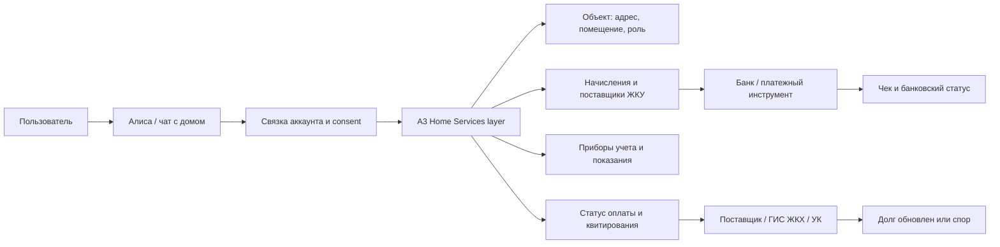

# Research Summary: A3 + Яндекс Алиса + платежи ЖКУ в умном доме

## Executive Summary

Идея не выглядит как копирование уже массового рынка. Публично подтвержденного сценария "скажи умной колонке оплатить ЖКУ, и она оплатит через домовой контекст" не найдено. Зато есть сильная opportunity: A3 может стать платежно-статусным слоем между домовым объектом, начислением ЖКУ, поставщиком, банком и conversational-интерфейсом Алисы.

Практически это не должно начинаться с опасного "Алиса, оплати все сама". Первый продуктовый вариант: Алиса находит счет, объясняет сумму/период/получателя, уточняет адрес, открывает защищенное подтверждение в приложении Алисы или банка, а после оплаты показывает цепочку статусов: `банк принял -> платеж отправлен -> поставщик/ГИС ЖКХ учел -> долг обновлен`.

Главная ценность A3 в этой связке — не кнопка оплаты, а нормализация и доказуемость: какой объект, какой лицевой счет, какой поставщик, какой период, какая сумма, где чек, почему долг может висеть после оплаты, кто следующий ответственный участник.

## Opportunity Statement

`Дом с Алисой` сегодня воспринимается как управление устройствами и сценариями жилья. A3 может расширить эту рамку до "дом как финансово-сервисный объект": счета, показания, статусы, заявки, семейные роли, напоминания и post-payment support. Тогда Алиса становится не кассиром, а понятным оператором домашнего контура.

## Что подтверждено, а что является гипотезой

| Утверждение | Статус | Как использовать |
|---|---|---|
| Яндекс развивает Алису в сторону smart building services: домофон, пропуска, шлагбаум, камеры, связка аккаунта ЖК с Яндекс ID | source-backed_by_subagent | Доказательство канала и близости к жилому комплексу |
| Яндекс Smart Home работает через account linking, platform API, состояние устройств и команды | source-backed_by_subagent | Техническая рамка для интеграции, но не платежный proof |
| Госуслуги.Дом / ГИС ЖКХ контур закрывает ЖКУ, показания, обращения и статусы в домене жилья | reused_from_prior_A3_run | Доменный proof спроса и процессов |
| Голосовые ассистенты требуют explicit linking/consent/PIN patterns для персональных и чувствительных действий | adjacent_evidence | Trust и security reference |
| Алиса уже умеет или публично заявляет оплату ЖКУ через smart building | not_found | Нельзя утверждать в pitch без проверки/партнерского подтверждения |
| A3 может собрать "чат с домом" поверх начислений, статусов и ролей | product_inference | Перспективная гипотеза для discovery |

## Product Thesis

Пользователь не хочет "платежку внутри умного дома" как отдельную функцию. Он хочет спросить дом простыми словами:

- "Что у меня с квартплатой?"
- "Почему долг висит?"
- "Оплати счет за квартиру, если все нормально."
- "Передай показания воды."
- "Напомни родителям оплатить."
- "Покажи чек и отправь маме."

Эти фразы должны превращаться в безопасные операции с явным объектом, источником данных и защищенным подтверждением.

## P0 Ставка

Первый релиз должен быть не автоплатежным, а confirmation-first:

1. Алиса понимает интент: оплата, долг, показания, напоминание.
2. A3 находит объект, лицевой счет, начисление, поставщика и статус.
3. Алиса проговаривает только безопасный минимум и просит открыть подтверждение.
4. В приложении показывается полный платежный контекст.
5. Деньги подтверждаются через банк/биометрию/PIN, не только голосом.
6. После оплаты пользователь видит статус банка отдельно от статуса поставщика/ГИС ЖКХ.

## MVP Scenarios

| Priority | Сценарий | Пользовательская задача | Почему именно он |
|---|---|---|---|
| P0 | Проверить счет ЖКУ | "Что пришло за квартиру?" | Самый безопасный вход: чтение и объяснение до оплаты |
| P0 | Подготовить оплату | "Оплати счет, если это мой адрес и правильный получатель" | Денежная ценность, но с обязательным app confirmation |
| P0 | Объяснить долг после оплаты | "Я заплатил, почему долг висит?" | Главная боль прошлого A3 исследования |
| P0 | Передать показания | "Скажи Алисе показания, но не ошибись в ХВС/ГВС" | Регулярный сценарий, сильная conversational fit |
| P0 | Напомнить | "Напомни оплатить/передать показания" | Безопасный low-risk entry point |
| P1 | Оплата за родителей | "Плачу за маму, не хочу заходить в ее аккаунт" | Сильный семейный use case, но нужна ролевая модель |
| P1 | Чат с домом | "Спросить одним диалогом про счет, долг, заявку, аварийку" | Делает Алису домовым оператором |
| P2 | Поверка, отключения, заявки, ремонт | "Что еще нужно дому?" | Расширение после платежного trust foundation |

## Ключевые кейсы

Ниже ключевые кейсы исследования: это не тезисная выжимка, а подробные кейсы с привязкой к жизненной ситуации, моменту сомнения и проверке.

| Кейс | Кто -> ситуация -> трение -> решение -> почему сработает -> как проверяем |
|---|---|
| K1. Собственник хочет оплатить текущий счет | Собственник живет в квартире и слышит от Алисы напоминание о новом счете. Трение: он боится оплатить не того получателя или не понять, почему сумма отличается от прошлой. Решение: Алиса находит счет, но открывает приложение с адресом, периодом, получателем, source timestamp и банковским подтверждением. Это сработает, если пользователь видит не только сумму, но и источник начисления до списания. Проверяем в usability task: 6/8 пользователей без подсказки называют адрес, период и получателя перед нажатием оплаты. |
| K2. Долг висит после оплаты | Пользователь вчера оплатил ЖКУ, сегодня видит долг и думает, что банк или A3 ошиблись. Трение: банковский статус и статус поставщика смешаны в один зеленый/красный индикатор. Решение: показать timeline `банк принял -> платеж отправлен -> поставщик учел -> долг обновлен` и дать чек/обращение. Это сработает, если пользователь понимает, кто сейчас отвечает за задержку. Проверяем сценарием: 6/8 пользователей правильно выбирают следующий шаг "подождать обновления" или "отправить чек поставщику". |
| K3. Взрослый ребенок платит за родителей | Пользователь платит за маму, но у него есть еще своя квартира. Трение: голосовая команда "оплати квартиру" может выбрать не тот объект, а полный доступ к аккаунту родителя избыточен. Решение: роль `family_payer`, явная метка объекта "Родители", крупное подтверждение адреса в приложении и отправка чека после оплаты. Это сработает, если плательщик не путает адрес и не видит лишние данные собственника. Проверяем task test с двумя объектами: не более одной критической ошибки выбора адреса. |
| K4. Пользователь передает показания голосом | Пользователь стоит у счетчиков и диктует значения Алисе. Трение: можно перепутать ХВС/ГВС или назвать значение меньше прошлого. Решение: A3 показывает прошлые значения, проверяет период и просит read-back "ХВС 130, ГВС 87. Отправить?". Это сработает, если голос ускоряет ввод, но финальное подтверждение ловит ошибку. Проверяем Wizard-of-Oz тестом: 80% корректно подтверждают значения перед отправкой. |

## Сквозной user flow

Сквозной user flow под CJM для P0:

1. Пользователь спрашивает Алису: "Что у меня с квартплатой?"
2. Алиса через account linking понимает профиль и передает запрос в A3.
3. A3 сопоставляет объект: адрес, помещение, роль, лицевой счет.
4. A3 возвращает текущий счет: сумма, период, получатель, источник и дата обновления.
5. Алиса кратко отвечает и предлагает открыть подтверждение в приложении.
6. В приложении пользователь проверяет адрес, сумму, получателя, комиссию и источник.
7. Пользователь подтверждает оплату через банк/биометрию/PIN.
8. После оплаты A3 показывает два слоя статуса: банковская операция и учет у поставщика/ГИС ЖКХ.
9. Если долг висит, пользователь открывает чек, видит дату последнего обновления у поставщика и может отправить обращение.

## Вопрос пользователя

| Stage | User question | Product answer |
|---|---|---|
| Найден счет | "Это точно моя квартира и правильный получатель?" | Адрес, роль, период, получатель, source timestamp |
| Перед оплатой | "Что произойдет, если я подтвержу?" | Деньги спишутся только после банковского подтверждения; голос не является списанием |
| После оплаты | "Почему долг еще виден?" | Банк и поставщик имеют разные статусы; показать timeline и дату обновления |
| Показания | "Я не перепутал холодную и горячую воду?" | Показать прошлые значения и read-back новых |
| Семейный объект | "Я плачу за родителей или за себя?" | Метка объекта, роль `family_payer`, крупный адрес перед оплатой |

## Метрики проверки

| Metric | Target | Why |
|---|---|---|
| `payment_context_comprehension` | 6/8 пользователей правильно называют адрес, период, получателя до оплаты | Проверяет, что голосовой старт не скрывает платежный контекст |
| `status_model_comprehension` | 6/8 пользователей различают банк, поставщика и долг после оплаты | Проверяет главный риск "оплатил, но долг висит" |
| `wrong_object_error_rate` | <= 1 critical error in 8 tests with two objects | Проверяет семейный и multi-object сценарий |
| `meter_readback_success` | 80% корректно подтверждают ХВС/ГВС перед отправкой | Проверяет безопасность голосового ввода показаний |
| `voice_to_app_handoff_acceptance` | majority preference for app confirmation over voice-only payment | Проверяет trust boundary MVP |

## Product Architecture Hypothesis

## Trust Model

| Риск | Что нельзя делать | Что делать вместо |
|---|---|---|
| Shared-device privacy | Проговаривать адрес, долг и сумму на колонке без контекста профиля | Дать краткий ответ и открыть детали в приложении |
| Ошибка распознавания | Платить по одной фразе при нескольких объектах | Read-back адреса, периода, получателя и суммы |
| Небезопасная оплата | Включать автосписание голосом | Голос готовит действие, деньги подтверждаются защищенно |
| Долг висит после оплаты | Говорить "оплачено" как финальный статус поставщика | Показывать разные статусы банка и поставщика |
| Семейный доступ | Давать плательщику полный аккаунт собственника | Роль "плательщик" с ограниченными данными |

## Как показать пользователю в приложении Алисы

Экран подтверждения должен выглядеть не как обычная квитанция, а как trust checkpoint:

- адрес и роль: "Вы платите за квартиру родителей";
- период и сумма;
- получатель и источник начисления;
- дата обновления данных;
- что произойдет после оплаты;
- способ оплаты и комиссия, если есть;
- CTA "Оплатить" только после банковского подтверждения;
- блок "После оплаты": чек, статус банка, статус поставщика, дата следующей проверки;
- recovery: "Долг еще висит?" с чеком и маршрутом обращения.

## Visual Evidence Plan

Lazyweb preflight по точным flow-запросам `chat payment confirmation bill pay` и `checkout confirmation` вернул нулевое покрытие. Поэтому текущий research pack не закрывает визуальный benchmark для макетов.

Перед Figma или frontend нужно отдельно собрать visual references:

1. реальные экраны Яндекс `Дом с Алисой` и Smart Building, если доступны;
2. экраны банковского подтверждения платежа ЖКУ;
3. экраны Госуслуги.Дом: счет, показания, обращение, статус;
4. voice assistant consent / account linking patterns;
5. chat/payment confirmation patterns из других источников, если Lazyweb не покрывает.

## Strategic Recommendation

Позиционировать концепт как `A3 Home Assistant Payments`, а не как "голосовая оплата ЖКУ".

Формула для pitch:

> A3 позволяет Алисе не просто управлять лампочками, а понимать дом как финансово-сервисный объект: найти счет, объяснить долг, подготовить оплату, принять показания и показать, кто отвечает за следующий статус.

## Open Questions

1. Может ли A3 получать не только начисление, но и статус квитирования у поставщика/ГИС ЖКХ?
2. Где будет финальное подтверждение: приложение Алисы, банк-партнер, webview A3, deep link в банк?
3. Какие данные можно безопасно проговаривать на колонке, а какие только показывать в приложении?
4. Как Яндекс трактует денежные операции внутри smart-home skills и skills moderation?
5. Можно ли начать с reminder/status-only MVP без платежа, чтобы проверить trust?
